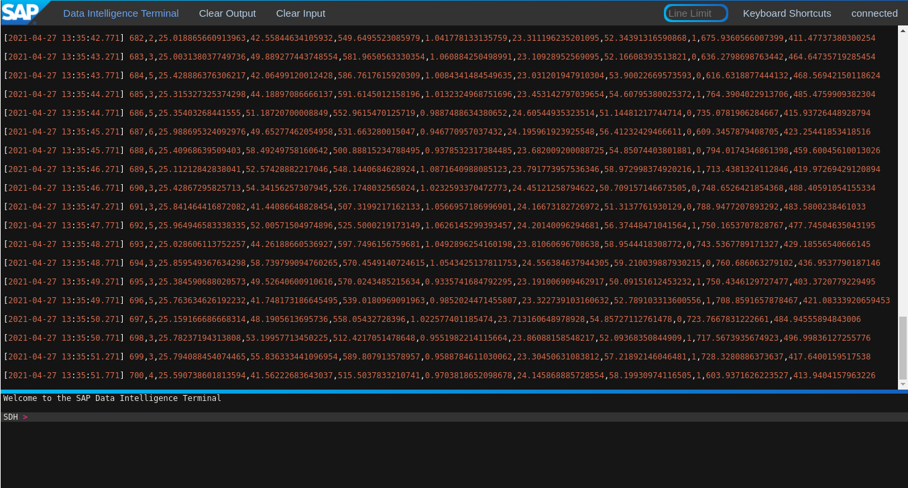

Quick Installation of  SAP Data Intelligence on Red Hat Openshift
==================================================================

## Intro

In case you want to testdrive SAP Data Intelligence (SDI), here is what you can do
to get a quick setup on an OpenShift Cluster.

If you do not know what SAP data intelligence is, I recommend this article:
 [What is data intelligence](https://blogs.sap.com/2020/01/16/what-is-data-intelligence/)

## prerequisites

To install SAP Data Intelligence (SDI) the following you need a running Openshift Cluster with at least 3 Worker nodes and access to Block and object storage.

The worker nodes need to have the following minimum requirements:

- 8 CPUs
- 32 GB memory
- 100 GB local ephemeral storage

In additon 250GB persistant volumes and 90GB for the container registry is needed
See also [Minimum Sizing for SAP Data Intelligence](https://help.sap.com/viewer/835f1e8d0dde4954ba0f451a9d4b5f10/3.1.latest/en-US/d771891d749d425ba92603ec9b0084a8.html)

For the checkpoint storage feature and the data lake feature you also need S3 storage

We have tested SDI with Red Hat OpenShift Container Storage (OCS) and the article will refer how to use this for providing the S3 storage. More Information on OpenShift Container Storage can be found [here](https://access.redhat.com/documentation/en-us/red_hat_openshift_container_storage/4.6/html-single/planning_your_deployment/index#platform-requirements_rhocs).

In case you do not have an Openshift cluster available the following table describes a feasible setup in AWS:

<table>
<caption>Openshift Requirements for SAP Data Intelligence Test Systems</caption>
<colgroup>
<col style="width: 14%" />
<col style="width: 14%" />
<col style="width: 14%" />
<col style="width: 14%" />
<col style="width: 14%" />
<col style="width: 14%" />
<col style="width: 14%" />
</colgroup>
<thead>
<tr class="header">
<th>Type</th>
<th>Count</th>
<th>Operating System</th>
<th>vCPU</th>
<th>RAM (GB)</th>
<th>Storage (GB)</th>
<th>AWS Instance Type</th>
</tr>
</thead>
<tbody>
<tr class="odd">
<td>
Bootstrap
</td>
<td>
1
</td>
<td>
RHCOS
</td>
<td>
2
</td>
<td>
16
</td>
<td>
120
</td>
<td>
i3.large
</td>
</tr>
<tr class="even">
<td>
Master
</td>
<td>
3+
</td>
<td>
RHCOS
</td>
<td>
4
</td>
<td>
16
</td>
<td>
120
</td>
<td>
m4.xlarge
</td>
</tr>
<tr class="odd">
<td>
Compute
</td>
<td>
3+
</td>
<td>
RHEL 7.6 or RHCOS
</td>
<td>
4
</td>
<td>
32
</td>
<td>
120
</td>
<td>
m4.2xlarge
</td>
</tr>
<tr class="even">
<td>
Storage
</td>
<td>
3+
</td>
<td>
RHCOS
</td>
<td>
10
</td>
<td>
24
</td>
<td>
120 + 2048
</td>
<td>
m5.4xlarge
</td>
</tr>
</tbody>
</table>

For a POC it is feasible to have only three Worker Nodes and you can aggregate the requirements. In production environments it is recommended to have SDI and OCS on separate worker nodes, which enables you to easier scaling of one or the other.

## High Level Installation Flow

For deploying SAP Data Intelligence the cluster the following steps need to be performed:

1. Label the worker nodes which should get SDI contents
2. Change the configuration of the SDI Worker Nodes to suite SAP's requirements
3. Deploy sdi-observer monitoring and installation helper tool from Red Hat
4. Prepare required S3 storage pools
5. Apply required lifted permissions to the SDI project
6. Deploy the SAP LifeCycle Manager Container Bridge (SLCB) for installing SDI
7. Launch the installation of SDI in SLCB01

During this process you need the following data:

- Your SAP S-User name and password for downloading the software
- login credentials to Red Hat Portal
- login credentials to access the Openshift Cluster with admin permissions

## Verify / prepare the management workstation

You need to prepare a management workstation from where you can access your OpenShift cluster, run ansible playbooks and a web browser session.
To make it easy, we assume a linux workstation based on RHEL or Fedora is assumed. If you are on Windows, MacOS or other Linux distribution you need to adapt the settings accordingly

1.  Login to your management workstation

2.  Ensure the following software is installed

    - jq for parsing json
    - ansible for automating the setup together with the python modules for managing Openshift
     - python3-pyyaml
     - python3-urllib3.noarch
     - python3-requests
     - python3-requests-oauthlib
     - python3-openshift (from EPEL)
    - yum-utils for managing repositories
    - git for loading data from github

    On RHEL 8 issue the following commands
        # dnf -y install ttps://dl.fedoraproject.org/pub/epel/epel-release-latest-8.noarch.rpm
        # sudo dnf -y ansible jq python3-pyyaml python3-urllib3 python3-requests python3-requests-oauthlib python3-openshift yum-utils

3. Install an openshift client according to your OCP version

        # OCP_VERSION=4.7.2
        # wget https://mirror.openshift.com/pub/openshift-v4/clients/ocp/${OCP_VERSION}/openshift-client-linux-${OCP_VERSION}.tar.gz
        # sudo tar zxvf openshift-client-linux-${OCP_VERSION}.tar.gz -C /usr/bin
        # sudo rm -f openshift-client-linux-${OCP_VERSION}.tar.gz /usr/bin/README.md
        # sudo chmod +x /usr/bin/oc /usr/bin/kubectl

4.  setup bash completion (optional)

        oc completion bash | sudo tee /etc/bash_completion.d/openshift > /dev/null

5. Clone the github repository with the ansible playbooks for configuring the clustername

       # git clone https://github.com/redhat-sap/??? TODO

## Verify Openshift Cluster

1.  make sure you have Openshift Cluster admin rights

        # oc whoami
        system:admin

    In case you do not have cluster-admin permissions, login with a user which has. In this article we assume this user is named `admin`:

        # oc login -u admin

2. check, that min requirements are met (example with 3 worker nodes):

        # oc get nodes
        ip-10-0-133-218.ec2.internal   Ready    master   47m   v1.20.0+5fbfd19
        ip-10-0-141-94.ec2.internal    Ready    worker   37m   v1.20.0+5fbfd19
        ip-10-0-154-232.ec2.internal   Ready    master   47m   v1.20.0+5fbfd19
        ip-10-0-159-127.ec2.internal   Ready    worker   40m   v1.20.0+5fbfd19
        ip-10-0-167-89.ec2.internal    Ready    master   48m   v1.20.0+5fbfd19
        ip-10-0-175-27.ec2.internal    Ready    worker   43m   v1.20.0+5fbfd19

    You should see 3 worker nodes and 3 master nodes

    >NOTE: If you see something like this after your systems shut down:
    >
    >      #  oc get nodes
    >      NAME                           STATUS     ROLES    AGE     VERSION
    >      ip-10-0-137-27.ec2.internal    NotReady   worker   2d23h   v1.20.0+5fbfd19
    >      ip-10-0-141-89.ec2.internal    NotReady   master   3d      v1.20.0+5fbfd19
    >      ip-10-0-154-182.ec2.internal   NotReady   master   3d      v1.20.0+5fbfd19
    >      ip-10-0-159-71.ec2.internal    NotReady   worker   2d23h   v1.20.0+5fbfd19
    >      ip-10-0-165-90.ec2.internal    NotReady   worker   2d23h   v1.20.0+5fbfd19
    >      ip-10-0-168-27.ec2.internal    NotReady   master   3d      v1.20.0+5fbfd19
    >
    >This can happen if the systems are shutdown for more then 24hrs and the certificates
    >are set invalid. The following command will manually approve the new certificates:
    >
    >     # oc adm certificate approve $(oc get csr | grep Pending | awk {'print $1'})

4. Store the worker names in a variable for later use:

        # WORKER=$(oc get nodes | awk ' ( $3 ~ "worker" ) {print $1 }')

5.  Check the hardware resources of the cluster Nodes

        # oc describe node $WORKER  | grep -A 6 Capacity
          Capacity:
            attachable-volumes-aws-ebs:  25
            cpu:                         16
            ephemeral-storage:           125293548Ki
            hugepages-1Gi:               0
            hugepages-2Mi:               0
            memory:                      64792280Ki
          --
          Capacity:
            attachable-volumes-aws-ebs:  25
            cpu:                         16
            ephemeral-storage:           125293548Ki
            hugepages-1Gi:               0
            hugepages-2Mi:               0
            memory:                      64792280Ki
          --
          Capacity:
            attachable-volumes-aws-ebs:  25
            cpu:                         16
            ephemeral-storage:           125293548Ki
            hugepages-1Gi:               0
            hugepages-2Mi:               0
            memory:                      64792280Ki

    So the minmum requirements are met with 64 GiB memory and 120 GiB local storage.

prepare OCP cluster for SDI
===========================

Switch to the directory with the ansible playbooks:

1. The playbook `ocp_prep_nodes.yml` will label *all* worker nodes in your cluster for use with SDI.
   Please change the variable `sdi_configure_ocp_worker_nodelist` if you want something different.
   you can also change the when statement, so that additional properties can be used for selecting nodes for SDI, e.g.

    ....

  The playbook will perform the following steps on all nodes in `sdi_configure_ocp_worker_nodelist`:

   1.  Label SDI compute Nodes with `node-role.kubernetes.io/sdi=""`
   2.  Enables net-raw capability for containers on schedulable nodes
   3.  Pre-load additional needed kernel modules for SDI (e.g. NFS and iptables)
   4.  Increasing PID limits to 16384
   5.  Associate MachineConfigs defined in step in 2-3 to the nodes with the label sdi

    It may take a while until all nodes are updated. The following
    command can be used to wait until the change gets applied to all the
    worker nodes:

           oc wait mcp/sdi --all --for=condition=updated

    The following command lists steh status of the nodes:

           oc get mcp

    > **Note**
    >
    > If the update is not working, check the machineconfig operator

6.  Now double check that settings are made

    you can use the following script to double check that all required
    changes are made on the Openshift Worker nodes

        #!/usr/bin/bash

        # CHECK OCP (Note Files may change after update)

        for worker in `oc get nodes|awk '/worker/{print $1}'`; do
          echo "Checking node $worker ------------------------------------------------------------------------------"
          # Check for additional kernelmodules
          oc debug node/$worker -- chroot /host cat /etc/crio/crio.conf.d/90-default-capabilities  2> /dev/null
          # Check for additional kernelmodules
          oc debug node/$worker -- chroot /host cat /etc/modules-load.d/sdi-dependencies.conf 2> /dev/null
          # check for module load service
          oc debug node/$worker -- chroot /host systemctl status sdi-modules-load.service 2> /dev/null
          # check for pidsLimit:
          oc debug node/$worker -- chroot /host cat /etc/crio/crio.conf.d/01-ctrcfg-pidsLimit
          echo "--------------------------------------------------------------------------------------------------------"
        done

Configure Storage
=================

Run the playbook `ocs-create-S3buckets.yml` to create a new project `sdi-infra` that keeps the S3 buckets for SDI:

    # ansible-playbook -i myhosts -vv ocs-create-S3buckets.yml

By default, two buckets will be created. You can list them this way:

    # bash <(curl -s https://raw.githubusercontent.com/redhat-sap/sap-data-intelligence/master/utils/mksdibuckets) list

      Bucket claim namespace/name:  sdi/sdi-checkpoint-store  (Status: Bound, Age: 7m33s)
        Cluster internal URL:       http://s3.openshift-storage.svc.cluster.local
        Bucket name:                sdi-checkpoint-store-ef4999e0-2d89-4900-9352-b1e1e7b361d9
        AWS_ACCESS_KEY_ID:          LQ7YciYTw8UlDLPi83MO
        AWS_SECRET_ACCESS_KEY:      8QY8j1U4Ts3RO4rERXCHGWGIhjzr0SxtlXc2xbtE
      Bucket claim namespace/name:  sdi/sdi-data-lake  (Status: Bound, Age: 7m33s)
        Cluster internal URL:       http://s3.openshift-storage.svc.cluster.local
        Bucket name:                sdi-data-lake-f86a7e6e-27fb-4656-98cf-298a572f74f3
        AWS_ACCESS_KEY_ID:          cOxfi4hQhGFW54WFqP3R
        AWS_SECRET_ACCESS_KEY:      rIlvpcZXnonJvjn6aAhBOT/Yr+F7wdJNeLDBh231

Deploy SDI OBSERVER
===================

SDI Observer is a redhat monitoring software that controls the behaviour
and the proper installation of SDI

Before running SDI Observer you need to create a service account for `registry.redhat.io` at
    <https://access.redhat.com/terms-based-registry/>, download and save
    it to `rht-registry-secret.yaml`

Now run the following playbook to deploy SDI observer

    # ansible-playbook -i myhosts -vv deploy-sdi-observer.yml

The playbook does the following;

1.  It create Namespaces for SDI Observer, SDI and the Install bridge:
  - sdi-observer
  - sdi
  - sap-slcbridge

2.  It create A Pull Secret for redhat registry within `sdi-observer`
    namespace

3.  It defines a couple of variables for SDI Observer & deploys it

    You can influence the behaviour of SDI observer by changing/adding  certain
    variables in the playbook. See
    <https://access.redhat.com/articles/5100521> section 4.1 for the
    variable lists.

    In particular we want sdi-observer to deploy a SDI compliant registry and to make sure that an OpenShift route is created after the installation of SDI.

    > **Note**
    >
    > You can change or at variables at a later time with the following
    > command:
    > `oc set env -n sdi-observer dc/sdi-observer <variable name>=<value>`

    > **Note**
    >
    > you can list the variables with
    > `oc set env  -n sdi-observer --list dc/sdi-observer`

    > **Note**
    >
    > If you change a variable afterwards a rebuild of sdi-observer might be required
    > you can trigger this with the following command:
    >
    > `oc  start-build -n sdi-observer -F bc/sdi-observer`

5. wait until sdi-observer and registry pods are running:

        $ oc get pods
        NAME                                READY   STATUS      RESTARTS   AGE
        container-image-registry-1-build    0/1     Completed   0          3m20s
        container-image-registry-1-deploy   0/1     Completed   0          82s
        container-image-registry-1-jkrx8    1/1     Running     0          79s
        deploy-registry-4gccn               0/1     Completed   0          3m26s
        sdi-observer-1-build                0/1     Completed   0          5m48s
        sdi-observer-1-deploy               0/1     Completed   0          3m53s
        sdi-observer-1-xphzw                1/1     Running     0          3m49s

    You can follow the deployment processes with e.g.

        oc logs sdi-observer-1-build -f
        oc logs container-image-registry-1-build -f

6.  Check Registry, get the credentials and configure OCP to trust the new registry

    The follwoing script tests the registry, prints the access
    credentials (which are needed for the installation) and makes some required additional settings in the cluster to trust the deployed DEPLOY\_SDI\_REGISTRY:

          #!/bin/bash

          ## Change Namespace to sdi-observer
          NAMESPACE="${NAMESPACE:-sdi-observer}"
          oc project sdi-observer

          ## Obtain registry credentials
          reg_credentials=$(oc get -n "${NAMESPACE:-sdi-observer}" secret/container-image-registry-htpasswd -o jsonpath='{.data.\.htpasswd\.raw }'  | base64 -d )
          reg_user=$(echo $reg_credentials| cut -d: -f1)
          reg_pw=$(echo $reg_credentials| cut -d: -f2)

          ## Obtain registry hostname
          reg_hostname="$(oc get route -n "${NAMESPACE:-sdi-observer}" container-image-registry -o jsonpath='{.spec.host}')"
          echo "================================================="
          echo "Using registry: $reg_hostname"
          echo "USER: $reg_user"
          echo "PW  : $reg_pw"
          echo "================================================="

          if [ -z "$reg_user" -o -z "$reg_pw" ]; then
                     echo "Something went wrong. Check if the pods are running"
                     exit 1
          fi

          ### Obtain Ingress Router's default self-signed CA certificate
          mkdir -p "/etc/containers/certs.d/${reg_hostname}"
          router_ca_crt="/etc/containers/certs.d/${reg_hostname}/router-ca.crt"
          oc get secret -n openshift-ingress-operator -o json router-ca | \
              jq -r '.data as $d | $d | keys[] | select(test("\\.crt$")) | $d[.] ' | base64 -d > ${router_ca_crt}

          ### test via curl
          curl -k -I --user ${reg_credentials}  --cacert ${router_ca_crt} "https://${reg_hostname}/v2/"

          ### test via podman
          echo $reg_pw |  podman login -u $reg_user --password-stdin ${reg_hostname}

          reg_login_ok=$?

          if [ $reg_login_ok ]; then
            # Configure Openshift to trust container registry (8.2)
            echo "Configure Openshift to trust container registry"
            echo "CTRL-C to stop, ENTER to continue"
            read zz
            caBundle="$(oc get -n openshift-ingress-operator -o json secret/router-ca | \
              jq -r '.data as $d | $d | keys[] | select(test("\\.(?:crt|pem)$")) | $d[.]' | base64 -d)"
            # determine the name of the CA configmap if it exists already
            cmName="$(oc get images.config.openshift.io/cluster -o json | \
              jq -r '.spec.additionalTrustedCA.name // "trusted-registry-cabundles"')"
            if oc get -n openshift-config "cm/$cmName" 2>/dev/null; then
              # configmap already exists -> just update it
              oc get -o json -n openshift-config "cm/$cmName" | \
                  jq '.data["'"${reg_hostname//:/..}"'"] |= "'"$caBundle"'"' | \
                  oc replace -f - --force
            else
                # creating the configmap for the first time
                oc create configmap -n openshift-config "$cmName" \
                    --from-literal="${reg_hostname//:/..}=$caBundle"
                oc patch images.config.openshift.io cluster --type=merge \
                    -p '{"spec":{"additionalTrustedCA":{"name":"'"$cmName"'"}}}'
            fi
            # Check that the certifcate is deployed
            sleep 10 # give some time for configuration
            oc rsh -n openshift-image-registry "$(oc get pods -n openshift-image-registry -l docker-registry=default | \
                  awk '/Running/ {print $1; exit}')" ls -1 /etc/pki/ca-trust/source/anchors

          else
            echo "Registry setup failed, please repair before you continue"
          fi

## Ensure that the project service accounts have correct priviledges

SDI uses a couple of serviceaccounts that need additional priviledges

    oc login -u admin
    oc project sdi
    oc adm policy add-scc-to-group anyuid "system:serviceaccounts:$(oc project -q)"
    oc adm policy add-scc-to-user privileged -z "$(oc project -q)-elasticsearch"
    oc adm policy add-scc-to-user privileged -z "$(oc project -q)-fluentd"
    oc adm policy add-scc-to-user privileged -z default
    oc adm policy add-scc-to-user privileged -z mlf-deployment-api
    oc adm policy add-scc-to-user privileged -z vora-vflow-server
    oc adm policy add-scc-to-user privileged -z "vora-vsystem-$(oc project -q)"
    oc adm policy add-scc-to-user privileged -z "vora-vsystem-$(oc project -q)-vrep"

## Install SDI Install Bridge

Now that the SDI observer is running, we can install the SDI Install
Bridge container that is used to install SDI on the cluster. The
following steps should run as the user `admin`.

    # oc login -u admin

    # oc whoami
    admin

> **Note**
>
> This document assumes your cluster has direct internet access. If you
> require proxy settings follow the steps in
> <https://access.redhat.com/articles/5100521> section 5.1

1.  Download the SAP install bridge from SAP (you need your S-User now)

    Go to the maintenance planner (MP) at https://apps.support.sap.com/sap/support/mp and click "Plan a New System:
    

    Select "CONTAINER based"
    

    Select "SAP DATA INTELLIGENCE", DI - Platform full, latest version (currently 3.1) and click Next
    

    Click Next
    

    Select Linux on x86_64 and Confirm Selection
    

    Select "SL CONTAINER BRIDE" and Click Next
    

    Select SLCB01_*.EXE, Click "Push to Download Basket" and Next
    

    Click "Execute Plan"
    

    Keep the browser tab open. You need to return here after installation of SLCB.

    Use [SAP Software Downloader](https://apps.support.sap.com/sap(bD1lbiZjPTAwMQ==)/support/knowledge/mimes/call.htm?number=1371839) to download the previously selected "SLCB01*.EXE" from the Downloadbasket.

    Alternatively you can download `SLCB01_<Version>.EXE for Linux` directly from
    <https://support.sap.com/>, rename it to `slcb` and make it
    executable (click `Software Downloads` and enter `Software Lifecycle Container Bridge` in the search field)

        # mv SLCB01_*.EXE /usr/bin/slcb
        # chmod +x /usr/bin/slcb

2.  Install SDI Install Bridge

    > **Note**
    >
    > This tutorial is tested with version 1.1.63. You can always
    > install this version with
    > `` `slcb init --bridgebaseVersion 1.1.63 ``, but any later version
    > should do, too.

    When answering the installer questions, the following selections are important:

    -   Installation Type: Expert Mode

    -   Service Type

        1. on AWS choose Loadbalancer. You do not need to give annotations

        2. on all other environments choose NodePort

    -   Have a look at <https://access.redhat.com/articles/5100521>, if
        you need to configure proxies - This article assumes direct
        connection to the internet

    - You need to provide the following information:

      - Address of the Container Image Repository
      - Image registry user name
      - Image registry password
      - Your S-User + password
      - admin user password

    Now you need the different credentials and information you noted
    earlier. Execute `slcb init`. Here is an example log:

            $ slcb init

            'slcb' executable information
            Executable:      slcb
            Build date:      2021-03-26 03:45:45 UTC
            Git branch:      fa/rel-1.1
            Git revision:    4f99471a2f764f65da2d72ef74c5259e8639697e
            Platform:        linux
            Architecture:    amd64
            Version:         1.1.62
            SL Core version: 1.0.0
            SLUI version:    2.6.67
            Arguments:       init
            Working dir:     /home/generic_emea_mkoch
            Schemata:        0.0.62, 1.13.62

            Explanation of supported shortcuts:
              <F1>:                 Display help for input value.
              <ENTER> or <Ctrl-N>:  Confirm and continue to next input value.
              <F12> or <Ctrl-B>:    Go back to previous input value.
              <r>:                  Retry current step.
              <e>:                  Edit a multi-line input value.
              <Ctrl-C>:             Abort current processing and return to the Welcome dialog of the SLC Bridge Base.
                                    Ctrl-C is not explicitly shown as an option in the command line prompt but you can always use it.
              <Tab>:                Completion of input values.
                                    In dialogs that accept only a restricted set of values (like files, directories etc)
                                    use the <Tab> key to cycle through the values or for completion of incomplete input.

            Execute step Download Bridge Images

            ***********************************
            * Product Bridge Image Repository *
            ***********************************

            Enter the address of your private container image repository used to store the bridge images.
            You require read and write permissions for this repository.
            Choose action <F12> for Back/<F1> for help
              Address of the Container Image Repository: container-image-registry-sdi-observer.apps.cluster-bf86.bf86.example.opentlc.com

            ************************
            * Image Registry User  *
            ************************

            The user name used to logon to "container-image-registry-sdi-observer.apps.cluster-bf86.bf86.example.opentlc.com".
            Choose action <F12> for Back/<F1> for help
              Image registry user name: user-q5j0lq
            Choose action <F12> for Back/<F1> for help
              Image registry password:

            ***************************
            * Enter Logon Information *
            ***************************

            You require S-User credentials to log on to the SAP Registry ("rhapi.repositories.cloud.sap") for product version "SL TOOLSET 1.0" (01200615320900005323)
            Choose action <F12> for Back/<F1> for help
              S-User Name: S0001234567
            Choose action <F12> for Back/<F1> for help
              Password:

            Copying image slcb://01200615320900005323.dockersrv.repositories.sapcdn.io/com.sap.sl.cbpod/slcbridgebase:1.1.62 to "container-image-registry-sdi-observer.apps.cluster-bf86.bf86.example.opentlc.com"
            Copying image slcb://01200615320900005323.dockersrv.repositories.sapcdn.io/com.sap.sl.cbpod/nginx-sidecar:1.1.62 to "container-image-registry-sdi-observer.apps.cluster-bf86.bf86.example.opentlc.com"
            Checking prerequisite

            Execute step Check Prerequisites
            I0331 13:01:04.372152    6354 request.go:621] Throttling request took 1.153431509s, request: GET:https://api.cluster-bf86.bf86.example.opentlc.com:6443/apis/flows.knative.dev/v1beta1?timeout=32s
            Checking prerequisite Kubernetes Server Version

            ************************
            *  Prerequiste Check   *
            ************************

            Checking the prerequisites for "SL Container Bridge" succeeded.

            Kubernetes Cluster Context:

            Cluster name:   api-cluster-bf86-bf86-example-opentlc-com:6443
            API server URL: https://api.cluster-bf86.bf86.example.opentlc.com:6443

            Editable Prerequisites

            Enter the path to the "kubectl" configuration file. The configuration information contained in this file will specify the cluster on which you are about to
            perform the deployment.
            Choose action <Tab> for completion/<F1> for help
              Path to the "kubeconfig" file: ESC[1G  Path to the "kubeconfig" file: /home/generic_emea_mkoch/.kube/configESC[0KESC[71G

            Prerequisite Check Result

            Name                      Current Value                         Result      Error Message
            KUBECONFIG                /home/generic_emea_mkoch/.kube/config + (passed)
            Kubernetes Server Version 1.20.0                                + (passed)

            Choose "Retry (r)" to retry the Prerequisite Check.
            Choose "Next (n)" to continue.

              Choose action Retry(r)/Next(n)/<F1> for help: n

            Execute step Collect Input

            ***************************************************************************
            * Choose whether you want to run the deployment in typical or expert mode *
            ***************************************************************************

            You can run the deployment either in typical or expert mode:

            - Typical Mode
               If you choose "Typical Mode", the option is performed with default settings. As a result, you only have to respond to a small selection of prompts.
            - Expert Mode
               If you choose "Expert Mode", you are prompted for all parameters.

               > 1. Typical Mode
                 2. Expert Mode
            Choose action <F12> for Back/<F1> for help
              possible values [1,2]: 2

            ************************
            * SLC Bridge Namespace *
            ************************

            Enter the Kubernetes namespace for the SLC Bridge.
            Choose action <F12> for Back/<Tab> for completion/<F1> for help
              Namespace: sap-slcbridge

            ************************
            *  Administrator User  *
            ************************

            Specify the name of the administrator user for the SLC Bridge Base.
            Choose action <F12> for Back/<F1> for help
              User Name: admin

            *******************************
            * Administrator User Password *
            *******************************

            Define the password of the administrator user admin
            Choose action <F12> for Back/<F1> for help
              Password of User admin:
              Confirm:

            ***********************************************
            * Service Type of the SLC Bridge Base Service *
            ***********************************************

            In order to access the SLC Bridge Base, the UI Port needs to be exposed. This is accomplished by defining a Kubernetes service.
            Kubernetes offers multiple service types. SAP currently supports the following service types. You have to select one of them.

            - Service Type "LoadBalancer" is suitable if your Kubernetes cluster comes with a controller for this service type. For example, this is the case for all
            hyperscaler platforms.
            - Service Type "NodePort" is suitable if your Kubernetes cluster runs on premise and the cluster nodes can be reached from your network

               > 1. Service Type LoadBalancer
                 2. Service Type NodePort
            Choose action <F12> for Back/<F1> for help
              possible values [1,2]: 2

              ************************
              *    Proxy Settings    *
              ************************

              Do you want to configure Proxy Settings for the Pods running in the cluster?

              This is necessary if the Pods in the cluster are running behind a proxy.

                 Configure Proxy Settings: n
              Choose action <F12> for Back/<F1> for help
                possible values [yes(y)/no(n)]: n

              Execute step Show Summary

              ************************
              *  Parameter Summary   *
              ************************

              Choose "Next" to start the deployment with the displayed parameter values or choose "Back" to revise the parameters.

              SLC Bridge Namespace
                 Namespace: sap-slcbridge

              Image Registry User
                 Image registry user name: user-q5j0lq

              SLP_BRIDGE_REPOSITORY_PASSWORD

              Enter Logon Information
                 S-User Name: S0000000000

              IMAGES_SAP_SUSER_PASSWORD

              KUBECONFIG
                 Path to the "kubeconfig" file: /home/generic_emea_mkoch/.kube/config

              Choose whether you want to run the deployment in typical or expert mode
                   1. Typical Mode
                 > 2. Expert Mode

              Administrator User
                 User Name: admin

              Administrator User Password

              Service Type of the SLC Bridge Base Service
                   1. Service Type LoadBalancer
                 > 2. Service Type NodePort

              Proxy Settings
                 Configure Proxy Settings: n

              Choose "Next" to start the deployment with the displayed parameter values or choose "Back" to revise the parameters.

                Choose action <F12> for Back/Next(n)/<F1> for help: ESC[1G  Choose action <F12> for Back/Next(n)/<F1> for help: n
              Apply Secret Template (secret-slcbridge.yml)...

              Execute step Master secret
              Apply Secret Template (secret-nginx.yml)...

              Execute step Nginx secret

              Execute step Wait for Kubernetes Object SLCBridgeNamespace

              Execute step Wait for Kubernetes Object SLCBridgeServiceAccount

              Execute step Wait for Kubernetes Object DefaultsMap

              Execute step Execute Service

              Execute step Wait for Kubernetes Object ProductHistory

              Execute step Wait for Kubernetes Object MasterSecret

              Execute step Wait for Kubernetes Object NginxSecret

              Execute step Wait for Kubernetes Object SLCBridgePod

              Execute step SL Container Bridge

              ************************
              *       Message        *
              ************************

              Deployment "slcbridgebase" has 1 available replicas in namespace "sap-slcbridge"
              Service slcbridgebase-service is listening on any of the kubernetes nodes on "https://node:30713/docs/index.html"

                Choose action Next(n)/<F1> for help: n

              Execute step Get User Feedback

              ******************************
              * Provide feedback to SAP SE *
              ******************************

              Dear user, please help us improve our software by providing your feedback (press <F1> for more information).

                 > 1. Fill out questionnaire
                   2. Send analytics data only
                   3. No feedback
              Choose action <F12> for Back/<F1> for help
                possible values [1,2,3]: 3
              Execute step Service Completed

3.  Check Bridge is running:

    If everything went well you can see the resources like this:

        $ oc -n sap-slcbridge get all
        NAME                                 READY   STATUS    RESTARTS   AGE
        pod/slcbridgebase-6cd8b94579-4l72q   2/2     Running   0          24m

        NAME                            TYPE       CLUSTER-IP      EXTERNAL-IP   PORT(S)          AGE
        service/slcbridgebase-service   NodePort   172.30.122.31   <none>        9000:30578/TCP   24m

        NAME                            READY   UP-TO-DATE   AVAILABLE   AGE
        deployment.apps/slcbridgebase   1/1     1            1           24m

        NAME                                       DESIRED   CURRENT   READY   AGE
        replicaset.apps/slcbridgebase-6cd8b94579   1         1         1       24m

4.  connect to the bridge

    1. If you are on AWS and have chosen LoadBalancer the installer prints the URL how to access the SLCB Bridge and your are done

    2. If you chose node port, the Service is exposed on the given port on any node of the cluster:

      Get the exposed node port and pick an IP address of one of the nodes
      and point your browser to:
      [https://&lt;IP&gt;:&lt;NodePort&gt;/docs/index.html](https://<IP>:<NodePort>/docs/index.html)

      -   Get IP: 

                $ oc get node -o wide sdi-worker-1
                NAME           STATUS   ROLES        AGE   VERSION           INTERNAL-IP    EXTERNAL-IP   OS-IMAGE                                                       KERNEL-VERSION                 CONTAINER-RUNTIME
                sdi-worker-1   Ready    sdi,worker   14d   v1.19.0+9c69bdc   10.19.20.160   <none>        Red Hat Enterprise Linux CoreOS 46.82.202101131942-0 (Ootpa)   4.18.0-193.40.1.el8_2.x86_64   cri-o://1.19.1-2.rhaos4.6.git2af9ecf.el8

      -   Get Port

                $ oc get svc -n "${SLCB_NAMESPACE:-sap-slcbridge}" slcbridgebase-service -o jsonpath=$'{.spec.ports[0].nodePort}\n'
                30578

        In this example point your browser to <https://10.19.20.160:30578/docs/index.html> to access the Installer

     3. if you have choosen NodePort, but the Nodes of your cluster are behind a firewall and not reachable with the above URL you can use OpenShift Portforwarding to access the installer. Run the following command:

                $ oc port-forward svc/slcbridgebase-service 8443:9000

             Now you can point your browser to <https://localhost:8443> to access the installer

     > **Note**
      >
      > Username/Password: Use the one that you provided during
      > installation

      If everything worked well, you should see this page now:

        

     Keep this page Open and continue in the maintenance planner window

SDI installation
----------------

Finally you can start the SDI Installation

1.  Now go back to the Maintenance Planner browser Tab

    > **Note**
    >
    > The bridge has to be opened in an active window all the time while
    > working with (MP)

    Enter the hostname and port from the previous step.
    

2.  Click Next and the Deploy
    

3.  If you see the following
    
    switch back to the SLCB browser tab. You will see this:
    
    Click OK

4. Now you need to enter Your S-User credentials and click next
   

5. Select "SAP DATA INTELLIGENCE 3 - DI Platform Full" and click next
   

6. Enter the OpenShift Namespace where SDI should run in. In our case it is `sdi` and click next
   

7. Select `Advanced Installation` and clck Next
   

8. Enter a password for he System Tenant Administrator
  

9.  Enter the Default Tenant name:

    

10.  Enter the Default Tenant Adminstrator name and password:

    

11.  As our cluster has direct access to the internet we do not need to
    set proxies. If this is different in you environment read [the SAP
    documentation](https://help.sap.com/viewer/a8d90a56d61a49718ebcb5f65014bbe7/3.1.latest/en-US/6a64f00a5ad643c79236b4a5fa09b79e.html)

    

12.  disable backup

    Do not configure backup: SAP Note 2918288

    \[…​\] the object storage infrastructure NooBaa cannot be used as
    backup media, if Vora is used.

    To disable backup be sure to remove the check mark (picture is
    default)

    

13.  enable Checkpoint store

    ensure the checkmark is set

    

    select `S3 Compatible object store` 

    Use the name and credentials for checkpoint store created earlier,
    the endpoint for NooBa S3 is always
    <http://s3.openshift-storage.svc.cluster.local>

    

    

    

    Even if your cluster is setup correctly, the validation takes a
    while. Don’t worry. If it fails, double check that you use http and
    not https. With private certificates this may not work

14.  Continue with the defaults on the next screens

    Use the default storage class for persistent volumes

    

    no special docker log path

    

    Enable Kaniko

    

    You do not need a differnt container image repo for modeler for demo
    purpose

    

    Enable load Kernel Modules, although this has been already handled
    by the installer. It will work without, but does not harm anything.

    

    Leave defaults

    

    

    

    

    

15.  Change the clustername to sdidemo-ghpte-$GUID (Replace with you lab GUID)

    

    Next is a summary of the installation parameters.

9.  Kick of the installation Kick of the installation. After
    installation the following screen appears

    

> **Caution**
>
> Note your System ID. In this example it is `11bw3dz`

Post Installation work
----------------------

###  Get Access to the SDI console

  We have configured the sdi-observer to make the route  to the admin interface available. You can check this with the following command:

        # oc rollout status -n sdi-observer -w dc/sdi-observer

   The system will come back with, if sdi-observer has exported the route correctly:

        replication controller "sdi-observer-2" successfully rolled out

  You can double check with

        # oc get routes -n sdi

  you will get a an output like:

        NAME      HOST/PORT                                                PATH   SERVICES   PORT      TERMINATION          WILDCARD
        vsystem   vsystem-sdi.apps.cluster-1251.1251.example.opentlc.com          vsystem    vsystem   reencrypt/Redirect   None

  You can now access the SDI management console at `https://vsystem-<SDI_NAMESPACE>.apps.<cluster_name>.<base_domain> `. In this example it is `https://vsystem-sdi.apps.cluster-1251.1251.example.opentlc.com`

### Configure the Connection to Data Lake

1. Login to the SDI Console at `https://vsystem-<SDI_NAMESPACE>.apps.<cluster_name>.<base_domain>` use the tenant `default`, user `defaultadmin` and the password from the installation procedure

 

 

2. Click Connection Management tile
 

3. Click on `+`

4. Enter the following values and click `Test Connection`:

  Parameter	            | Value
  ----------------------|--------
  Connection Type	      | SDL
  Id	                  | DI_DATA_LAKE
  Object Storage Type   |	S3
  Endpoint              |	http://s3.openshift-storage.svc.cluster.local
  Access Key ID	        |  from above (see storage-credentials.txt)
  Secret Access Key	    |  from above (see storage-credentials.txt)
  Root Path	            |  from above (see storage-credentials.txt)

  

5. If connection test is successful click on `Create`

  

6. done

  

## SDI validation

Finally you can do the following steps to validate that your installation of SAP Data Intelligence
has been successful. The process is described at [Sap Data Intelligence Installation Guide](https://help.sap.com/viewer/a8d90a56d61a49718ebcb5f65014bbe7/3.1.2/en-US/1551785f3d7e4d37af7fe99185f7acb6.html)
Now go back to the Data Intelligence Launchpad  (or login like in the previous step)

###  Define a pipeline

  1. Launch the Modeler running by clicking the Modeler tile (be patient, it takes a while)
      

  2. Enter `com.sap.demo.datagenerator` in the search field and click on Data Genrator.
      

  3. Save the configuration:
      

  4. Start the graph.
      

  5. Check that the status changes to Running (this may take several minutes).
      

  6. Open the Terminal user interface, by right-click the Terminal operator and selecting `OpenUI`.
      

  7. Once the Data Generator is running you will get something like the following, otherwise an error is shown
      

  8. Stop the graph once you observe its output in the Terminal.
      

### Check Your Machine Learning setup

1. To create an ML scenario, open `ML Scenario Manager` from the SAP Data Intelligence Launchpad
    
    Be patient the first start takes a while

2. Click `Create` and

     a. enter a name for your scenario and

     b,  Optional: a business question that you want to answer (such as How strong will the weekly sales be in our store?)

     c. Click `Create`.

     

  The details for your scenario appear and your scenario is added to the list of ML scenarios on the overview page.

3. On the details page for your scenario, click `Create` in the Notebooks tab  to create a new Jupyter Notebook.

      a. In the Create Notebook dialog box, enter a unique name for your notebook.

      b. Optional: Enter a description of your notebook.

      c. Click Create to create your Jupyter notebook.

     

    The creation takes a while until your notebook opens in JupyterLab.

4. When you open your notebook for the first time, you are prompted to select your kernel. Choose Python 3.
   

5. In your JupyterLab notebook, copy the following code into a cell and run it:

        import sapdi
        from hdfs import InsecureClient
        client = InsecureClient('http://datalake:50070')
        client.status("/")

   

  Check that the code runs without errors.

  The code should return JSON similar to the following:

        {'pathSuffix': '',
         'type': 'DIRECTORY',
         'length': 0,
         'owner': 'admin',
         'group': 'admin',
         'permission': '777',
         'accessTime': 0,
         'modificationTime': 1576237423061,
         'blockSize': 0,
         'replication': 1}

 
