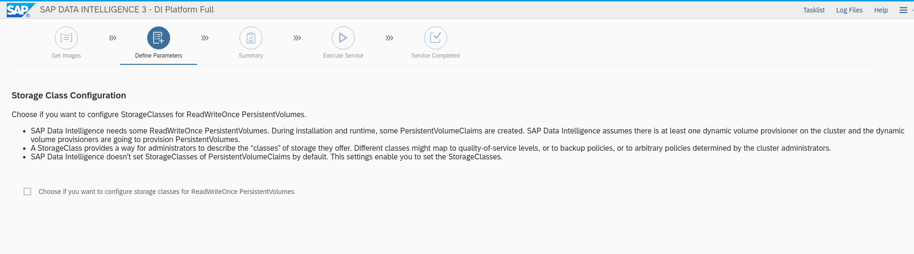
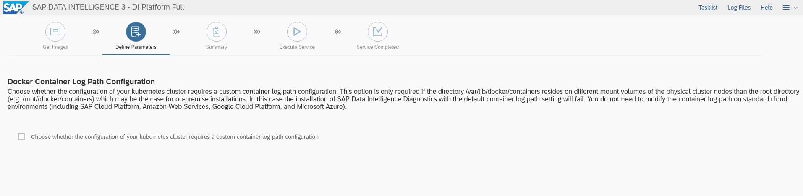
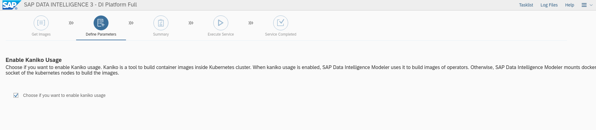
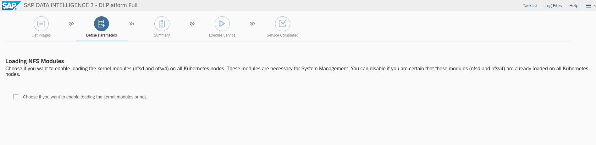
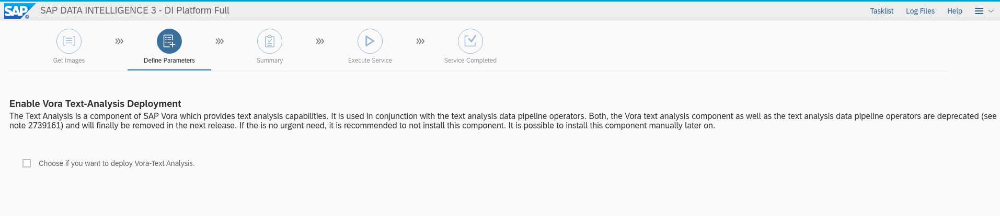
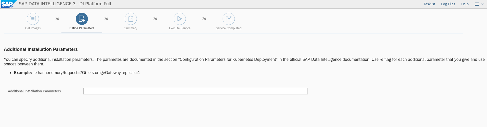
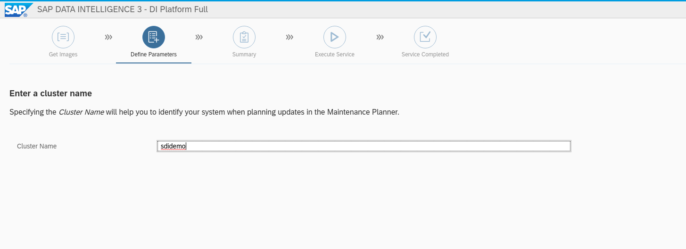
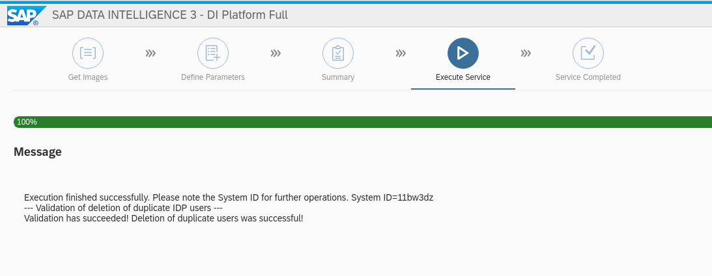

// Get Source from OCP4 install Lab //

# SAP Data Intelligence installation

## prerequisites

To install SAP Data Intelligence (SDI) you should have prepared the following

* A running Openshift Cluster with at least

  ** 3 master nodes
  ** 3 worker nodes for SDI with minimum requirements
  ** 3 worker nodes with OCS storage (optional AWS S3 storage)

* Your SAP S-User data for downloading the software
* A management node/jumphost to access the Openshift Cluster

NOTE: This document assumes direct internet access from the OpenShift Cluster. For different
setups please see the complete Knowledgebase article at https://access.redhat.com/articles/5100521

Requirements and the minimum number of instances for each node type. This is sufficient of a PoC (Proof of Concept) environments.

.Openshift Requirements for SAP Data Intelligence Test Systems
[width="40%",frame="topbot",options="header,footer"]
|===================================================================================
| Type  | Count| Operating System |vCPU| RAM (GB)|Storage (GB)| AWS  Instance Type
| Bootstrap |1 | RHCOS            |2|16| 120 |i3.large
| Master    |3+| RHCOS            |4|16| 120 |m4.xlarge
| Compute   |3+| RHEL 7.6 or RHCOS|4|32| 120 |m4.2xlarge
| Storage   |3+| RHCOS            | |  |     |
| Jump host |1 | RHEL 7.6         |2| 4| 75  |t2.medium
|===================================================================================

## Verify the manangement workstation

. Login to the managament host
+
----
ssh <admin-user>@<management host>
----

. Ensure the following software is installed
+
- jq
- openshift client

.. get jq
+
----
dnf install jq
----

.. get oc CLI tool
+
----
OCP_VERSION=4.6.12
wget https://mirror.openshift.com/pub/openshift-v4/clients/ocp/${OCP_VERSION}/openshift-client-linux-${OCP_VERSION}.tar.gz
sudo tar zxvf openshift-client-linux-${OCP_VERSION}.tar.gz -C /usr/bin
sudo rm -f openshift-client-linux-${OCP_VERSION}.tar.gz /usr/bin/README.md
sudo chmod +x /usr/bin/oc /usr/bin/kubectl
----

. setup bash completion (optional)
+
----
oc completion bash | sudo tee /etc/bash_completion.d/openshift > /dev/null
----

## Verify Openshift Cluster

. make sure you have Openshift Cluster admin rights
+
----
[root@provisioner ~]# oc whoami
system:admin
----

. check, that min requirements are met:
+
----
# oc get nodes
NAME           STATUS   ROLES        AGE     VERSION
master-0       Ready    master       8d      v1.19.0+9c69bdc
master-1       Ready    master       8d      v1.19.0+9c69bdc
master-2       Ready    master       8d      v1.19.0+9c69bdc
sdi-worker-1   Ready    worker       7d20h   v1.19.0+9c69bdc
sdi-worker-2   Ready    worker       7d20h   v1.19.0+9c69bdc
sdi-worker-3   Ready    worker       7d20h   v1.19.0+9c69bdc
worker-0       Ready    worker       7d23h   v1.19.0+9c69bdc
worker-1       Ready    worker       7d23h   v1.19.0+9c69bdc
worker-2       Ready    worker       7d23h   v1.19.0+9c69bdc
----
You should see at least 6 worker nodes, `worker-{0,1,2}`  is used for OCS and `sdi-worker-{1,2,3}`
will be used to install SAP Data Intelligence
+
NOTE: It is a good practise to name the nodes according to its workload. In this example the `worker-*`
nodes run OCS and the `sdi-worker-*` nodes run the storage. The naming convention helps to better
identify the usage.

.  Check the hardware resources of the cluster Nodes
+
----
# oc describe node sdi-worker-{1,2,3}  | grep -A 6 Capacity
Capacity:
  cpu:                72
  ephemeral-storage:  1171528260Ki
  hugepages-1Gi:      0
  hugepages-2Mi:      0
  memory:             65821172Ki
  pods:               250
--
Capacity:
  cpu:                72
  ephemeral-storage:  1171528260Ki
  hugepages-1Gi:      0
  hugepages-2Mi:      0
  memory:             65821172Ki
  pods:               250
--
Capacity:
  cpu:                72
  ephemeral-storage:  1171528260Ki
  hugepages-1Gi:      0
  hugepages-2Mi:      0
  memory:             65821172Ki
  pods:               250
----

## prepare OCP cluster for SDI

. Label SDI compute Nodes
+
----
# oc label node/sdi-worker-{1,2,3} node-role.kubernetes.io/sdi=""
----
+
NOTE: If you want to remove the label again run `oc label node/worker-{0,1,2} node-role.kubernetes.io/sdi-`

. Enable net-raw capability for containers on schedulable nodes
+
Check existing with:
+
----
oc get machineconfigs -o yaml 97-crio-net-raw
----
+
if this doesn't exist run:
+
----
#  oc create -f - <<EOF
apiVersion: machineconfiguration.openshift.io/v1
kind: MachineConfig
metadata:
  labels:
    machineconfiguration.openshift.io/role: sdi
  name: 97-crio-net-raw
spec:
  config:
    ignition:
      version: 2.2.0
    storage:
      files:
      - contents:
          source: data:text/plain;charset=utf-8;base64,W2NyaW8ucnVudGltZV0KZGVmYXVsdF9jYXBhYmlsaXRpZXMgPSBbCiAgICAgICAgIkNIT1dOIiwKICAgICAgICAiREFDX09WRVJSSURFIiwKICAgICAgICAiRlNFVElEIiwKICAgICAgICAiRk9XTkVSIiwKICAgICAgICAiU0VUR0lEIiwKICAgICAgICAiU0VUVUlEIiwKICAgICAgICAiU0VUUENBUCIsCiAgICAgICAgIk5FVF9CSU5EX1NFUlZJQ0UiLAogICAgICAgICJLSUxMIiwKICAgICAgICAiTkVUX1JBVyIsCl0K
          verification: {}
        filesystem: root
        mode: 420
        path: /etc/crio/crio.conf.d/90-default-capabilities
EOF
----
+
NOTE: If you get the message: `Error from server (AlreadyExists): error when creating "STDIN": machineconfigs.machineconfiguration.openshift.io "97-crio-net-raw" already exists`
rerun with `oc replace -f`

. Pre-load needed kernel modules
+
Check existing with:
+
----
oc get machineconfigs -o yaml 75-worker-sap-data-intelligence
----
+
The follwoing command prints the config file, if it exists on the host
+
----
for worker in `oc get nodes  | awk '/worker/{print $1}'`; do
   oc debug node/$worker -- chroot /host cat /etc/modules-load.d/sdi-dependencies.conf
   oc debug node/$worker -- chroot /host systemctl status sdi-modules-load.service
done
----
+
If the modules file does not exist run the following to create it:
+
----
# oc replace -f - <<EOF
apiVersion: machineconfiguration.openshift.io/v1
kind: MachineConfig
metadata:
 labels:
   machineconfiguration.openshift.io/role: sdi
 name: 75-worker-sap-data-intelligence
spec:
 config:
   ignition:
     version: 2.2.0
   storage:
     files:
     - contents:
         source: "data:text/plain;charset=utf-8;base64,$content"
         verification: {}
       filesystem: root
       mode: 420
       path: /etc/modules-load.d/sdi-dependencies.conf
   systemd:
     units:
     - contents: |
         [Unit]
         Description=Pre-load kernel modules for SAP Data Intelligence
         After=network.target

         [Service]
         Type=oneshot
         ExecStart=/usr/sbin/modprobe iptable_nat
         ExecStart=/usr/sbin/modprobe iptable_filter
         RemainAfterExit=yes

         [Install]
         WantedBy=multi-user.target
       enabled: true
       name: sdi-modules-load.service
EOF
machineconfig.machineconfiguration.openshift.io/75-worker-sap-data-intelligence replaced
----

. PID limits
+
Check if PID Limits are already set:
+
----
# for worker in `oc get nodes  | awk '/sdi-worker/{print $1}'`; do
  oc debug node/$worker chroot /host -- cat /etc/crio/crio.conf.d/ /etc/crio/crio.conf.d/01-ctrcfg-pidsLimit
done | grep -i pids_limit
----
+
NOTE: the file path may change using a different OCP version

+
check if the config is already created:
+
----
oc get ContainerRuntimeConfigs -o yaml sdi-pids-limit
----
+
Create the runtime config
+
----
# oc create -f - <<EOF
apiVersion: machineconfiguration.openshift.io/v1
kind: ContainerRuntimeConfig
metadata:
name: sdi-pids-limit
spec:
machineConfigPoolSelector:
  matchLabels:
   workload: sapdataintelligence
containerRuntimeConfig:
  pidsLimit: 16384
EOF
containerruntimeconfig.machineconfiguration.openshift.io/sdi-pids-limit created
----

. Associate MachineConfigs to the Nodes
+
The machine configs match to a machine config pool is  labeled `workload: sapdataintelligence`.
the follwing command creates a machine config pool out of nodes which have the role `SDI` labeled
`workload: sapdataintelligence`. Hence the new config is created on these nodes by the machine operator.
+
----
# oc create -f - <<EOF
apiVersion: machineconfiguration.openshift.io/v1
kind: MachineConfigPool
metadata:
  labels:
    workload: sapdataintelligence
  name: sdi
spec:
  machineConfigSelector:
    matchExpressions:
    - key: machineconfiguration.openshift.io/role
      operator: In
      values:
      - sdi
      - worker
  nodeSelector:
    matchLabels:
      node-role.kubernetes.io/sdi: ''
EOF
----
+
It may take a while until all nodes are updated.  The following command can be used to wait until the change gets applied to all the worker nodes:
+
----
oc wait mcp/sdi --all --for=condition=updated
----
+
The following command lists steh status of the nodes:
+
----
 oc get mcp
----
+
NOTE: If the update is not working, check the machineconfig operator

. Double check that settings are made
+
you can use the following script to double check that all required changes are made on the
Openshift Worker nodes
+
----
#!/usr/bin/bash

# CHECK OCP (Note Files may change after update)

for worker in `oc get nodes|awk '/worker/{print $1}'`; do
  echo "Checking node $worker ------------------------------------------------------------------------------"
  # Check for additional kernelmodules
  oc debug node/$worker -- chroot /host cat /etc/crio/crio.conf.d/90-default-capabilities  2> /dev/null
  # Check for additional kernelmodules
  oc debug node/$worker -- chroot /host cat /etc/modules-load.d/sdi-dependencies.conf 2> /dev/null
  # check for module load service
  oc debug node/$worker -- chroot /host systemctl status sdi-modules-load.service 2> /dev/null
  # check for pidsLimit:
  oc debug node/$worker -- chroot /host cat /etc/crio/crio.conf.d/01-ctrcfg-pidsLimit
  echo "--------------------------------------------------------------------------------------------------------"
done
----

## Configure Storage

. Check that OCS is properly installed
+
*TODO* -> Please give hints how to do this

. Create Project to keep SDI Storage
+
----
# oc new-project sdi-infra
Now using project "sdi-infra" on server "https://api.lab.hpecloud.org:6443".

You can add applications to this project with the 'new-app' command. For example, try:

    oc new-app django-psql-example

to build a new example application in Python. Or use kubectl to deploy a simple Kubernetes application:

    kubectl create deployment hello-node --image=gcr.io/hello-minikube-zero-install/hello-node

[root@provisioner ~]# oc project
Using project "sdi-infra" on server "https://api.lab.hpecloud.org:6443".
----

. Create  S3 buckets for checkpoint store (required) and data lake (optional)
+
----
# for claimName in sdi-checkpoint-store sdi-data-lake; do
   oc create -f - <<EOF
apiVersion: objectbucket.io/v1alpha1
kind: ObjectBucketClaim
metadata:
 name: ${claimName}
spec:
 generateBucketName: ${claimName}
 storageClassName: openshift-storage.noobaa.io
EOF
done
objectbucketclaim.objectbucket.io/sdi-checkpoint-store created
objectbucketclaim.objectbucket.io/sdi-data-lake created
----
+
Check if buckets are created:
+
----
# oc get obc -w
NAME                   STORAGE-CLASS                 PHASE   AGE
sdi-checkpoint-store   openshift-storage.noobaa.io   Bound   58s
sdi-data-lake          openshift-storage.noobaa.io   Bound   58s
----

. Get the credentials required by the SDI installer
+
----
# for claimName in sdi-checkpoint-store sdi-data-lake; do
   printf 'Bucket/claim %s:\n  Bucket name:\t%s\n' "$claimName" "$(oc get obc -o jsonpath='{.spec.bucketName}' "$claimName")"
   for key in AWS_ACCESS_KEY_ID AWS_SECRET_ACCESS_KEY; do
     printf '  %s:\t%s\n' "$key" "$(oc get secret "$claimName" -o jsonpath="{.data.$key}" | base64 -d)"
   done
done | column -t -s $'\t'

Bucket/claim sdi-checkpoint-store:
  Bucket name:                      sdi-checkpoint-store-22d885f0-da59-4d24-bffa-5e908bf78d1d
  AWS_ACCESS_KEY_ID:                < keep this >
  AWS_SECRET_ACCESS_KEY:            < keep this >
Bucket/claim sdi-data-lake:
  Bucket name:                      sdi-data-lake-c132663c-b96b-4e6a-ba3b-01db3e999f82
  AWS_ACCESS_KEY_ID:                < keep this >
  AWS_SECRET_ACCESS_KEY:            < keep this >
----

# Deploy SDI OBSERVER

SDI Observer is a redhat monitoring software that controls the behaviour and  the proper
installation of SDI

. Create Namespaces for SDI Observer:
+
----
#  NAMESPACE=sdi-observer SDI_NAMESPACE=sdi SLCB_NAMESPACE=sap-slcbridge
#  for nm in $SDI_NAMESPACE $SLCB_NAMESPACE $NAMESPACE; do oc new-project $nm; done
----

. Create a service account for `registry.redhat.io` at https://access.redhat.com/terms-based-registry/,
download and save it to `rht-registry-secret.yaml`

. Create the Pull Secret for redhat registry within sdi-observer namespace:
+
----
# oc create -n "${NAMESPACE:-sdi-observer}" -f rht-registry-secret.yaml
secret/5318290-sap-di-westford-pull-secret created
----
+
. double check that the
. set the variables for SDI Observer & install
+
You can influence the behaviour of SDI observer by setting certain environment variables.
See https://access.redhat.com/articles/5100521 section 4.1 for the variable lists

+
----

NAMESPACE=sdi-observer
SDI_NAMESPACE=sdi
SLCB_NAMESPACE=sap-slcbridge
OCP_MINOR_RELEASE=4.6
#NODE_LOG_FORMAT=text
DEPLOY_SDI_REGISTRY=true
INJECT_CABUNDLE=true
#BUNDLE_SECRET_NAME=openshift-ingress-operator/router-ca
MANAGE_VSYSTEM_ROUTE=true
REDHAT_REGISTRY_SECRET_NAME=5318290-sap-di-westford-pull-secret
SDI_NODE_SELECTOR=node-role.kubernetes.io/sdi=

oc process -f https://raw.githubusercontent.com/redhat-sap/sap-data-intelligence/master/observer/ocp-template.json \
        NAMESPACE="${NAMESPACE:-sdi-observer}" \
        SDI_NAMESPACE="${SDI_NAMESPACE:-sdi}" \
        SLCB_NAMESPACE="${SLCB_NAMESPACE:-sap-slcbridge}" \
        OCP_MINOR_RELEASE="${OCP_MINOR_RELEASE:-4.6}" \
        DEPLOY_SDI_REGISTRY="${DEPLOY_SDI_REGISTRY:-true}" \
        INJECT_CABUNDLE="${INJECT_CABUNDLE:-true}" \
        MANAGE_VSYSTEM_ROUTE="${MANAGE_VSYSTEM_ROUTE:-true}" \
        SDI_NODE_SELECTOR="${SDI_NODE_SELECTOR}" \
        REDHAT_REGISTRY_SECRET_NAME="$REDHAT_REGISTRY_SECRET_NAME" | oc create -f -

----
+
NOTE: You can change or at variables at a later time with the following command: `oc set env -n sdi-observer dc/sdi-observer <variable name>=<value>`
+

NOTE: you can list the variables with `oc set env  -n sdi-observer --list dc/sdi-observer`

+
. Check Registry, get the credentials and and configure OCP to trust do appropriate settings:
+
The follwoing script tests the registry, prints the access credentials and makes some required additional settings
in the cluster to trust the deployed DEPLOY_SDI_REGISTRY:
+
----
#!/bin/bash

## Change Namespace to sdi-observer
NAMESPACE="${NAMESPACE:-sdi-observer}"
oc project sdi-observer

## Obtain registry credentials
reg_credentials=$(oc get -o json -n "${NAMESPACE:-sdi-observer}" secret/container-image-registry-htpasswd | jq -r '.data[".htpasswd.raw"] | @base64d')
reg_user=$(echo $reg_credentials| cut -d: -f1)
reg_pw=$(echo $reg_credentials| cut -d: -f2)

## Obtain registry hostname
reg_hostname="$(oc get route -n "${NAMESPACE:-sdi-observer}" container-image-registry -o jsonpath='{.spec.host}')"
echo "================================================="
echo "Using registry: $reg_hostname"
echo "USER: $reg_user"
echo "PW  : $reg_pw"
echo "================================================="

### Obtain Ingress Router's default self-signed CA certificate
mkdir -p "/etc/containers/certs.d/${reg_hostname}"
router_ca_crt="/etc/containers/certs.d/${reg_hostname}/router-ca.crt"
oc get secret -n openshift-ingress-operator -o json router-ca | \
    jq -r '.data as $d | $d | keys[] | select(test("\\.crt$")) | $d[.] | @base64d' > ${router_ca_crt}

### test via curl
curl -I --user ${reg_credentials}  --cacert ${router_ca_crt} "https://${reg_hostname}/v2/"

### test via podman
echo $reg_pw |  podman login -u $reg_user --password-stdin ${reg_hostname}

reg_login_ok=$?

if [ $reg_login_ok ]; then
  # Configure Openshift to trust container registry (8.2)
  echo "Configure Openshift to trust container registry"
  echo "CTRL-C to stop, ENTER to continue"
  read zz
  caBundle="$(oc get -n openshift-ingress-operator -o json secret/router-ca | \
    jq -r '.data as $d | $d | keys[] | select(test("\\.(?:crt|pem)$")) | $d[.] | @base64d')"
  # determine the name of the CA configmap if it exists already
  cmName="$(oc get images.config.openshift.io/cluster -o json | \
    jq -r '.spec.additionalTrustedCA.name // "trusted-registry-cabundles"')"
  if oc get -n openshift-config "cm/$cmName" 2>/dev/null; then
    # configmap already exists -> just update it
    oc get -o json -n openshift-config "cm/$cmName" | \
        jq '.data["'"${reg_hostname//:/..}"'"] |= "'"$caBundle"'"' | \
        oc replace -f - --force
  else
      # creating the configmap for the first time
      oc create configmap -n openshift-config "$cmName" \
          --from-literal="${reg_hostname//:/..}=$caBundle"
      oc patch images.config.openshift.io cluster --type=merge \
          -p '{"spec":{"additionalTrustedCA":{"name":"'"$cmName"'"}}}'
  fi
  # Check that the certifcate is deployed
  oc rsh -n openshift-image-registry "$(oc get pods -n openshift-image-registry -l docker-registry=default | \
        awk '/Running/ {print $1; exit}')" ls -1 /etc/pki/ca-trust/source/anchors

else
  echo "Registry setup failed, please repair before you continue"
fi
----

## Install SDI Install Bridge

Now that the SDI observer is running, we can install the SDI Install Bridge container that is
used to install SDI on the Cluster
The following steps should run as the user `sdiadmin` with the appropriate cluster rules

----
# oc whoami
sdiadmin
----

NOTE: This document assumes your cluster has direct internet access. If you require
proxy settings follow the steps in https://access.redhat.com/articles/5100521 section 5.1

. Download the SAP install bridge from SAP (you need your S-User now)
+
Download SLCB01_<Version>.EXE for Linux from https://support.sap.com/, rename it to `slcb` and make it
executable
+
----
# mv SLCB01_*.EXE /usr/bin/slcb
# chmod +x /usr/bin/slcb
----
+
. Install SDI Install Bridge
+
NOTE: This tutorial is tested with version 1.1.58. You can always install this version with
``slcb init --bridgebaseVersion 1.1.58`, but any later version should do, too.

+
When answering the installer, the following slections are important:

* Installation Type: Expert Mode
* Service Type NodePort
* Have a look at https://access.redhat.com/articles/5100521, if you need to configure proxies - This example assumes direct connection
  to the internet
+
Now you need the different credentials and information you noted earlier. Execute `slcb init`.
Here is an example log:
+
----
$ slcb init

'slcb' executable information
Executable:   slcb
Build date:   2020-12-18 15:30:09 UTC
Git branch:   fa/rel-1.1
Git revision: 13d28b8fd5352a6fb058fa86622c8deef4abf841
Platform:     linux
Architecture: amd64
Version:      1.1.58
SLUI version: 2.6.66
Arguments:    init
Working dir:  /home/mkoch
Schemata:     0.0.58, 1.11.58

Execute step Download Bridge Images

***********************************
* Product Bridge Image Repository *
***********************************

Enter the address of your private container image repository used to store the bridge images.
You require read and write permissions for this repository.
  Address of the Container Image Repository [<F1>]: container-image-registry-sdi-observer.apps.lab.hpecloud.org

************************
* Image Registry User  *
************************

The user name used to logon to "container-image-registry-sdi-observer.apps.lab.hpecloud.org".
  Image registry user name [<F1>]: user-x4sawa
  Image registry password [<F1>]:

***************************
* Enter Logon Information *
***************************

You require S-User credentials to log on to the SAP Registry ("rhapi.repositories.cloud.sap") for product version "SL TOOLSET 1.0" (01200615320900005323)
  S-User Name [<F1>]: S0000012345
  Password [<F1>]:

Copying image slcb://01200615320900005323.dockersrv.repositories.sapcdn.io/com.sap.sl.cbpod/slcbridgebase:1.1.58 to "container-image-registry-sdi-observer.apps.lab.hpecloud.org"
Copying image slcb://01200615320900005323.dockersrv.repositories.sapcdn.io/com.sap.sl.cbpod/nginx-sidecar:1.1.58 to "container-image-registry-sdi-observer.apps.lab.hpecloud.org"

Execute step Check Prerequisites

************************
*  Prerequiste Check   *
************************

Checking the prerequisites for "SL Container Bridge" succeeded.

Kubernetes Cluster Context:

Cluster name:   api-lab-hpecloud-org:6443
API server URL: https://api.lab.hpecloud.org:6443

Editable Prerequisites

Enter the path to the "kubectl" configuration file. The configuration information contained in this file will specify the cluster on which you are about to perform the deployment.
  Path to the "kubeconfig" file [<F1>]: /home/mkoch/.kube/config

Prerequisite Check Result

Name                      Current Value            Result      Error Message
KUBECONFIG                /home/mkoch/.kube/config + (passed)
Kubernetes Server Version 1.19.0                   + (passed)

Choose "Retry" to retry the Prerequisite Check.
Choose "Back" to go back to Product Information Dialog.
Choose "Next" to continue.

  Choose action Retry/Next [r/n/<F1>]: n

Execute step Collect Input

***************************************************************************
* Choose whether you want to run the deployment in typical or expert mode *
***************************************************************************

You can run the deployment either in typical or expert mode:

- Typical Mode
   If you choose "Typical Mode", the option is performed with default settings. As a result, you only have to respond to a small selection of prompts.
- Expert Mode
   If you choose "Expert Mode", you are prompted for all parameters.

   > 1. Typical Mode
     2. Expert Mode
  possible values [1,2] [<F1>]: 2

************************
* SLC Bridge Namespace *
************************

Enter the Kubernetes namespace for the SLC Bridge.
  Namespace [<F1>]: sap-slcbridge

************************
*  Administrator User  *
************************

Specify the name of the administrator user for the SLC Bridge Base.
  User Name [<F1>]: sdiadmin

*******************************
* Administrator User Password *
*******************************

Define the password of the administrator user sdiadmin
  Password of User sdiadmin [<F1>]:
  Confirm:

***********************************************
* Service Type of the SLC Bridge Base Service *
***********************************************

In order to access the SLC Bridge Base, the UI Port needs to be exposed. This is accomplished by defining a Kubernetes service.
Kubernetes offers multiple service types. SAP currently supports the following service types. You have to select one of them.

- Service Type "LoadBalancer" is suitable if your Kubernetes cluster comes with a controller for this service type. For example, this is the case for all hyperscaler platforms.
- Service Type "NodePort" is suitable if your Kubernetes cluster runs on premise and the cluster nodes can be reached from your network

   > 1. Service Type LoadBalancer
     2. Service Type NodePort
  possible values [1,2] [<F1>]: 2

************************
*    Proxy Settings    *
************************

Do you want to configure Proxy Settings for the Pods running in the cluster?

This is necessary if the Pods in the cluster are running behind a proxy.

   Configure Proxy Settings: n
  possible values [y/n] [<F1>]: n

Execute step Show Summary

************************
*  Parameter Summary   *
************************

Choose "Next" to start the deployment with the displayed parameter values or choose "Back" to revise the parameters.

SLC Bridge Namespace
   Namespace: sap-slcbridge

Image Registry User
   Image registry user name: user-x4sawa

SLP_BRIDGE_REPOSITORY_PASSWORD

Enter Logon Information
   S-User Name: S0008065507

IMAGES_SAP_SUSER_PASSWORD

KUBECONFIG
   Path to the "kubeconfig" file: /home/mkoch/.kube/config

Choose whether you want to run the deployment in typical or expert mode
     1. Typical Mode
   > 2. Expert Mode

Administrator User
   User Name: sdiadmin

Administrator User Password

Service Type of the SLC Bridge Base Service
     1. Service Type LoadBalancer
   > 2. Service Type NodePort

Proxy Settings
   Configure Proxy Settings: n

Choose "Next" to start the deployment with the displayed parameter values or choose "Back" to revise the parameters.

  Choose action Next [n/<F1>]: n
Apply Secret Template (secret-slcbridge.yml)...

Execute step Master secret
Apply Secret Template (secret-nginx.yml)...

Execute step Nginx secret

Execute step Wait for Kubernetes Object SLCBridgeNamespace

Execute step Wait for Kubernetes Object SLCBridgeServiceAccount

Execute step Wait for Kubernetes Object DefaultsMap

Execute step Wait for Kubernetes Object ProductHistory

Execute step Wait for Kubernetes Object MasterSecret

Execute step Wait for Kubernetes Object NginxConf

Execute step Wait for Kubernetes Object NginxSecret

Execute step Wait for Kubernetes Object NetworkPolicy

Execute step Wait for Kubernetes Object SLCBridgePod

Execute step SL Container Bridge

************************
*       Message        *
************************

Deployment "slcbridgebase" has 1 available replicas in namespace "sap-slcbridge"
Service slcbridgebase-service is listening on any of the kubernetes nodes on "https://node:30578/docs/index.html"

  Choose action Next [n/<F1>]: n

Execute step Get User Feedback

******************************
* Provide feedback to SAP SE *
******************************

Dear user, please help us improve our software by providing your feedback (press <F1> for more information).

   > 1. Fill out questionnaire
     2. Send analytics data only
     3. No feedback
  possible values [1,2,3] [<F1>]: 3

Execute step Service Completed

----
+
NOTE: this is an interactive script, which currently cannot run unattended
+
. Check Bridge is running:
+

If everything went well you can see the resources like this:
+
----
$ oc -n sap-slcbridge get all
NAME                                 READY   STATUS    RESTARTS   AGE
pod/slcbridgebase-6cd8b94579-4l72q   2/2     Running   0          24m

NAME                            TYPE       CLUSTER-IP      EXTERNAL-IP   PORT(S)          AGE
service/slcbridgebase-service   NodePort   172.30.122.31   <none>        9000:30578/TCP   24m

NAME                            READY   UP-TO-DATE   AVAILABLE   AGE
deployment.apps/slcbridgebase   1/1     1            1           24m

NAME                                       DESIRED   CURRENT   READY   AGE
replicaset.apps/slcbridgebase-6cd8b94579   1         1         1       24m

----

. connect to the bridge
+
Get the exposed node port and pick an IP address of one of the nodes and point your browser to: https://<IP>:<NodePort>/docs/index.html
+
** Get IP: 
+
----
oc get node -o wide sdi-worker-1
NAME           STATUS   ROLES        AGE   VERSION           INTERNAL-IP    EXTERNAL-IP   OS-IMAGE                                                       KERNEL-VERSION                 CONTAINER-RUNTIME
sdi-worker-1   Ready    sdi,worker   14d   v1.19.0+9c69bdc   10.19.20.160   <none>        Red Hat Enterprise Linux CoreOS 46.82.202101131942-0 (Ootpa)   4.18.0-193.40.1.el8_2.x86_64   cri-o://1.19.1-2.rhaos4.6.git2af9ecf.el8
----
+
** Get Port
+
----
oc get svc -n "${SLCB_NAMESPACE:-sap-slcbridge}" slcbridgebase-service -o jsonpath=$'{.spec.ports[0].nodePort}\n'
30578
----
+
In this example point your browser to https://10.19.20.160:30578/docs/index.html
+
NOTE: Username/Password: Use the one that you provided during installation
+
You should see this:
+
image:images/image10.png[image]

## SDI installation

Finally you can start the SDI Installation

. Go to the maintenance planner (MP) at https://apps.support.sap.com/sap/support/mp and start the installation.
+
NOTE: The bridge has to be opened in an active window all the time while working with (MP)

+
First you have to enter a password
+
image:images/image13.png[image]

. Enter the Default Tenant name:
+
image:images/image9.png[image]

. Enter the Default Tenant Adminstrator name and password:
+
image:images/image20.png[image]

. As our cluster has direct access to the internet we do not need to set proxies. If this is different
in you environment read https://help.sap.com/viewer/a8d90a56d61a49718ebcb5f65014bbe7/3.1.latest/en-US/6a64f00a5ad643c79236b4a5fa09b79e.html[the SAP documentation]
+
image:images/image14.png[image]

. disable backup
+
Do not configure backup: SAP Note 2918288
+
[...] the object storage infrastructure NooBaa cannot be used as backup media, if Vora is used.
+
To disable backup be sure to remove the check mark (picture is default)
+
image:images/image25.png[image]

. enable Checkpoint store
+
ensure the checkmark is set
+
image:images/image8.png[image]
+
select `S3 Compatible object store`
image:images/image1.png[image]
+
Use the name and credentials for checkpoint store created earlier, the endpoint for NooBa S3 is always
http://s3.openshift-storage/svc.cluster.local
+
image:images/image19.png[image]image:images/image11.png[image]
+
image:images/image21.png[image]
+
image:images/image2.png[image]
+
Even if your cluster is setup correctly, the validation takes a while. Don't worry.
If it fails, double check that you use http and not https. With private certificates this may not work

. Continue with the defaults on the next screens
+
Use the default storage class for persistent volumes
+

+
no special docker log path
+

+
Enable Kaniko
+

+
You do not need a differnt container image repo for modeler for demo purpose
+
image:images/image24.png[image]
+
Enable load Kernel Modules, although this has been already handled by the installer
+

+
Leave defaults
+
image:images/image15.png[image]
+

+
image:images/image17.png[image]
+
image:images/image18.png[image]
+

. It makes sense to change the default clustername: e.g. to sdidemo
+

+
Next is a summary of the installation parameters.

. Kick of the installation
Kick of the installation. After installation the following screen appears
+

CAUTION: Note your System ID. In this example it is  `11bw3dz`

## Post Installation work

. Configure SDI-Observer to manage routes:
+
----
# oc rollout status -n "$\{NAMESPACE:-sdi-observer}" -w dc/sdi-observer

replication controller "sdi-observer-2" successfully rolled out
----
+
Depending on the services you want/need  to expose follow the post installation steps at section 5.5.1.2
at https://access.redhat.com/articles/5100521

*TODO* Define the important ones for the demo Here

## Check that SDI is working properly

*TODO*
