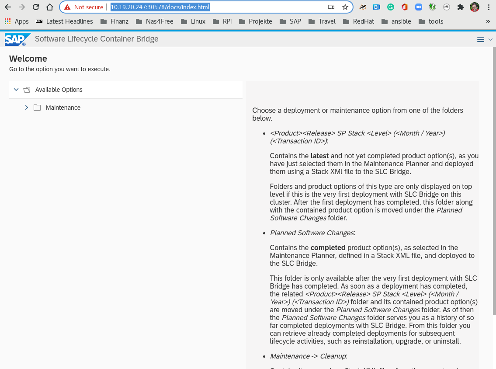
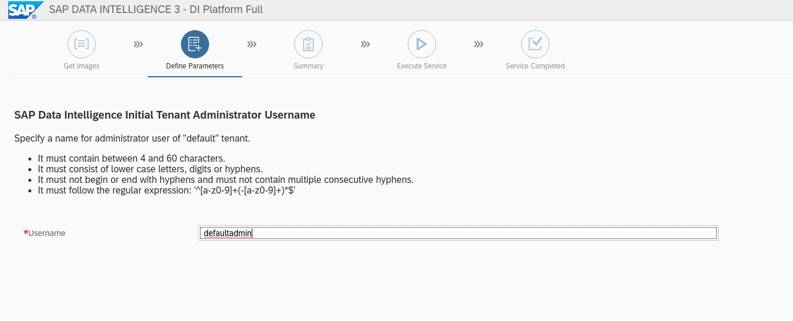
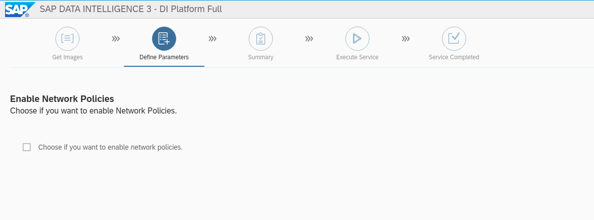

Install SAP Data Intelligence Lab
==================================

## Intro

This workshop demonstrates the installation of SAP Data Intelligence 3.1 on Red Hat OpenShift 4.6

## High-level architecture and components

The high-level architecture consists of 3 different RHEL 8.x servers:

- **bastion**: this is meant to be used as the jump host for SSH access to the environment and where to run SAP GUI from if required.
- **hana**: this is meant to be used as the RHEL server where you can deploy SAP HANA.
- **s4hana**: this is meant to be used as the RHEL server where you can deploy SAP S/4HANA.

And an OpenShift 4.x cluster with the following components deployed:

- **OpenShift Container Storage**: used for multi-purpose container storage backend.

## prerequisites

To install SAP Data Intelligence (SDI) the following is needed

-   A running Openshift Cluster with at least

    -   3 master nodes

    -   3 worker nodes for SDI with minimum requirements and for OCS storage

-   Your SAP S-User data for downloading the software

-   login credentials to the bastion host to access the Openshift Cluster

> **Note**
>
> In the test environment we install on 3 worker nodes including the storage, in a
> production environment it is recommended to have the SDI worker nodes and the
> storage worker nodes on separate nodes. For more detailed sizing guidelines look at
> https://access.redhat.com/articles/5100521#ftnt-ocs-requirements

Requirements and the minimum number of instances for each node type.
This is sufficient of a PoC (Proof of Concept) environments.

<table>
<caption>Openshift Requirements for SAP Data Intelligence Test Systems</caption>
<colgroup>
<col style="width: 14%" />
<col style="width: 14%" />
<col style="width: 14%" />
<col style="width: 14%" />
<col style="width: 14%" />
<col style="width: 14%" />
<col style="width: 14%" />
</colgroup>
<thead>
<tr class="header">
<th>Type</th>
<th>Count</th>
<th>Operating System</th>
<th>vCPU</th>
<th>RAM (GB)</th>
<th>Storage (GB)</th>
<th>AWS Instance Type</th>
</tr>
</thead>
<tbody>
<tr class="odd">
<td>
Bootstrap
</td>
<td>
1
</td>
<td>
RHCOS
</td>
<td>
2
</td>
<td>
16
</td>
<td>
120
</td>
<td>
i3.large
</td>
</tr>
<tr class="even">
<td>
Master
</td>
<td>
3+
</td>
<td>
RHCOS
</td>
<td>
4
</td>
<td>
16
</td>
<td>
120
</td>
<td>
m4.xlarge
</td>
</tr>
<tr class="odd">
<td>
Compute
</td>
<td>
3+
</td>
<td>
RHEL 7.6 or RHCOS
</td>
<td>
4
</td>
<td>
32
</td>
<td>
120
</td>
<td>
m4.2xlarge
</td>
</tr>
<tr class="even">
<td>
Storage
</td>
<td>
3+
</td>
<td>
RHCOS
</td>
<td>
10
</td>
<td>
24
</td>
<td>
120
</td>
<td>
m5.4xlarge
</td>
</tr>
</tbody>
</table>

## Verify the management workstation

1.  Login to the managament host (you will find your login credentials in the Lab information)

        ssh <admin-user>@<management host>

2.  Ensure the following software is installed

    -   jq
            # sudo dnf -y install jq

    -   openshift client

            # OCP_VERSION=4.7.2
            # wget https://mirror.openshift.com/pub/openshift-v4/clients/ocp/${OCP_VERSION}/openshift-client-linux-${OCP_VERSION}.tar.gz
            # sudo tar zxvf openshift-client-linux-${OCP_VERSION}.tar.gz -C /usr/bin
            # sudo rm -f openshift-client-linux-${OCP_VERSION}.tar.gz /usr/bin/README.md
            # sudo chmod +x /usr/bin/oc /usr/bin/kubectl

3.  setup bash completion (optional)

        oc completion bash | sudo tee /etc/bash_completion.d/openshift > /dev/null

## Verify Openshift Cluster

1.  make sure you have Openshift Cluster admin rights

        [root@provisioner ~]# oc whoami
        system:admin

2. Delete existing projects
        # oc delete project serverless
        # oc delete project side-by-sidecar

3. check, that min requirements are met:

        # oc get nodes
        ip-10-0-133-218.ec2.internal   Ready    master   47m   v1.20.0+5fbfd19
        ip-10-0-141-94.ec2.internal    Ready    worker   37m   v1.20.0+5fbfd19
        ip-10-0-154-232.ec2.internal   Ready    master   47m   v1.20.0+5fbfd19
        ip-10-0-159-127.ec2.internal   Ready    worker   40m   v1.20.0+5fbfd19
        ip-10-0-167-89.ec2.internal    Ready    master   48m   v1.20.0+5fbfd19
        ip-10-0-175-27.ec2.internal    Ready    worker   43m   v1.20.0+5fbfd19

    You should see 3 worker nodes and 3 master nodes

4. Store the worker names in a variable for later use:

        # WORKER=$(oc get nodes | awk ' ( $3 ~ "worker" ) {print $1 }')

5.  Check the hardware resources of the cluster Nodes

        # oc describe node $WORKER  | grep -A 6 Capacity
          Capacity:
            attachable-volumes-aws-ebs:  25
            cpu:                         16
            ephemeral-storage:           125293548Ki
            hugepages-1Gi:               0
            hugepages-2Mi:               0
            memory:                      64792280Ki
          --
          Capacity:
            attachable-volumes-aws-ebs:  25
            cpu:                         16
            ephemeral-storage:           125293548Ki
            hugepages-1Gi:               0
            hugepages-2Mi:               0
            memory:                      64792280Ki
          --
          Capacity:
            attachable-volumes-aws-ebs:  25
            cpu:                         16
            ephemeral-storage:           125293548Ki
            hugepages-1Gi:               0
            hugepages-2Mi:               0
            memory:                      64792280Ki

    So the minmum requirements 64 GiB memory and 120 GiB Storage are met

prepare OCP cluster for SDI
===========================

1.  Label SDI compute Nodes

        for n in $WORKER; do
        oc label node/$n node-role.kubernetes.io/sdi=""
        done

    > **Note**
    >
    > If you want to remove the label again use
    > `oc label node/$n node-role.kubernetes.io/sdi-`

2.  Enable net-raw capability for containers on schedulable nodes

    Check existing with:

        oc get machineconfigs -o yaml 97-crio-net-raw

    if this doesn’t exist run:

        #  oc create -f - <<EOF
        apiVersion: machineconfiguration.openshift.io/v1
        kind: MachineConfig
        metadata:
          labels:
            machineconfiguration.openshift.io/role: sdi
          name: 97-crio-net-raw
        spec:
          config:
            ignition:
              version: 2.2.0
            storage:
              files:
              - contents:
                  source: data:text/plain;charset=utf-8;base64,W2NyaW8ucnVudGltZV0KZGVmYXVsdF9jYXBhYmlsaXRpZXMgPSBbCiAgICAgICAgIkNIT1dOIiwKICAgICAgICAiREFDX09WRVJSSURFIiwKICAgICAgICAiRlNFVElEIiwKICAgICAgICAiRk9XTkVSIiwKICAgICAgICAiU0VUR0lEIiwKICAgICAgICAiU0VUVUlEIiwKICAgICAgICAiU0VUUENBUCIsCiAgICAgICAgIk5FVF9CSU5EX1NFUlZJQ0UiLAogICAgICAgICJLSUxMIiwKICAgICAgICAiTkVUX1JBVyIsCl0K
                  verification: {}
                filesystem: root
                mode: 420
                path: /etc/crio/crio.conf.d/90-default-capabilities
        EOF

    > **Note**
    >
    > If you get the message:
    > `Error from server (AlreadyExists): error when creating "STDIN": machineconfigs.machineconfiguration.openshift.io "97-crio-net-raw" already exists`
    > rerun with `oc replace -f`

3.  Pre-load needed kernel modules

    Check existing with:

        oc get machineconfigs -o yaml 75-worker-sap-data-intelligence

    The follwoing command prints the config file, if it exists on the
    host

        for worker in `oc get nodes  | awk '/worker/{print $1}'`; do
           oc debug node/$worker -- chroot /host cat /etc/modules-load.d/sdi-dependencies.conf
           oc debug node/$worker -- chroot /host systemctl status sdi-modules-load.service
        done

    If the modules file does not exist run the following to create it:

        # oc create -f - <<EOF
        apiVersion: machineconfiguration.openshift.io/v1
        kind: MachineConfig
        metadata:
         labels:
           machineconfiguration.openshift.io/role: sdi
         name: 75-worker-sap-data-intelligence
        spec:
         config:
           ignition:
             version: 2.2.0
           storage:
             files:
             - contents:
                 source: "data:text/plain;charset=utf-8;base64,$content"
                 verification: {}
               filesystem: root
               mode: 420
               path: /etc/modules-load.d/sdi-dependencies.conf
           systemd:
             units:
             - contents: |
                 [Unit]
                 Description=Pre-load kernel modules for SAP Data Intelligence
                 After=network.target

                 [Service]
                 Type=oneshot
                 ExecStart=/usr/sbin/modprobe iptable_nat
                 ExecStart=/usr/sbin/modprobe iptable_filter
                 RemainAfterExit=yes

                 [Install]
                 WantedBy=multi-user.target
               enabled: true
               name: sdi-modules-load.service
        EOF

4.  PID limits

    Check if PID Limits are already set:

        # for worker in `oc get nodes  | awk '/sdi-worker/{print $1}'`; do
          oc debug node/$worker chroot /host -- cat /etc/crio/crio.conf.d/ /etc/crio/crio.conf.d/01-ctrcfg-pidsLimit
        done | grep -i pids_limit

    > **Note**
    >
    > the file path may change using a different OCP version

    check if the config is already created:

        oc get ContainerRuntimeConfigs -o yaml sdi-pids-limit

    Create the runtime config

        # oc create -f - <<EOF
        apiVersion: machineconfiguration.openshift.io/v1
        kind: ContainerRuntimeConfig
        metadata:
          name: sdi-pids-limit
        spec:
          machineConfigPoolSelector:
            matchLabels:
             workload: sapdataintelligence
          containerRuntimeConfig:
            pidsLimit: 16384
        EOF

5.  Associate MachineConfigs to the Nodes

    The machine configs match to a machine config pool is labeled
    `workload: sapdataintelligence`. the follwing command creates a
    machine config pool out of nodes which have the role `SDI` labeled
    `workload: sapdataintelligence`. Hence the new config is created on
    these nodes by the machine operator.

        # oc create -f - <<EOF
        apiVersion: machineconfiguration.openshift.io/v1
        kind: MachineConfigPool
        metadata:
          labels:
            workload: sapdataintelligence
          name: sdi
        spec:
          machineConfigSelector:
            matchExpressions:
            - key: machineconfiguration.openshift.io/role
              operator: In
              values:
              - sdi
              - worker
          nodeSelector:
            matchLabels:
              node-role.kubernetes.io/sdi: ''
        EOF

    It may take a while until all nodes are updated. The following
    command can be used to wait until the change gets applied to all the
    worker nodes:

        oc wait mcp/sdi --all --for=condition=updated

    The following command lists steh status of the nodes:

         oc get mcp

    > **Note**
    >
    > If the update is not working, check the machineconfig operator

6.  Double check that settings are made

    you can use the following script to double check that all required
    changes are made on the Openshift Worker nodes

        #!/usr/bin/bash

        # CHECK OCP (Note Files may change after update)

        for worker in `oc get nodes|awk '/worker/{print $1}'`; do
          echo "Checking node $worker ------------------------------------------------------------------------------"
          # Check for additional kernelmodules
          oc debug node/$worker -- chroot /host cat /etc/crio/crio.conf.d/90-default-capabilities  2> /dev/null
          # Check for additional kernelmodules
          oc debug node/$worker -- chroot /host cat /etc/modules-load.d/sdi-dependencies.conf 2> /dev/null
          # check for module load service
          oc debug node/$worker -- chroot /host systemctl status sdi-modules-load.service 2> /dev/null
          # check for pidsLimit:
          oc debug node/$worker -- chroot /host cat /etc/crio/crio.conf.d/01-ctrcfg-pidsLimit
          echo "--------------------------------------------------------------------------------------------------------"
        done

Configure Storage
=================

1.  Check that OCS is properly installed

    **TODO** → Please give hints how to do this

2.  Create Project to keep SDI Storage

        # oc new-project sdi-infra

3.  Create S3 buckets for checkpoint store (required) and data lake
    (optional)

        # for claimName in sdi-checkpoint-store sdi-data-lake; do
           oc create -f - <<EOF
        apiVersion: objectbucket.io/v1alpha1
        kind: ObjectBucketClaim
        metadata:
         name: ${claimName}
        spec:
         generateBucketName: ${claimName}
         storageClassName: openshift-storage.noobaa.io
        EOF
        done

    Expect the following output

        objectbucketclaim.objectbucket.io/sdi-checkpoint-store created
        objectbucketclaim.objectbucket.io/sdi-data-lake created

    Check if buckets are created:

        # oc get obc -w
        NAME                   STORAGE-CLASS                 PHASE   AGE
        sdi-checkpoint-store   openshift-storage.noobaa.io   Bound   58s
        sdi-data-lake          openshift-storage.noobaa.io   Bound   58s

4.  Get the credentials required by the SDI installer

        # for claimName in sdi-checkpoint-store sdi-data-lake; do
           printf 'Bucket/claim %s:\n  Bucket name:\t%s\n' "$claimName" "$(oc get obc -o jsonpath='{.spec.bucketName}' "$claimName")"
           for key in AWS_ACCESS_KEY_ID AWS_SECRET_ACCESS_KEY; do
             printf '  %s:\t%s\n' "$key" "$(oc get secret "$claimName" -o jsonpath="{.data.$key}" | base64 -d)"
           done
        done | column -t -s $'\t' | tee storage-credentials.txt

        Bucket/claim sdi-checkpoint-store:
          Bucket name:                      sdi-checkpoint-store-22d885f0-da59-4d24-bffa-5e908bf78d1d
          AWS_ACCESS_KEY_ID:                < keep this >
          AWS_SECRET_ACCESS_KEY:            < keep this >
        Bucket/claim sdi-data-lake:
          Bucket name:                      sdi-data-lake-c132663c-b96b-4e6a-ba3b-01db3e999f82
          AWS_ACCESS_KEY_ID:                < keep this >
          AWS_SECRET_ACCESS_KEY:            < keep this >

Deploy SDI OBSERVER
===================

SDI Observer is a redhat monitoring software that controls the behaviour
and the proper installation of SDI

1.  Create Namespaces for SDI Observer:

        #  NAMESPACE=sdi-observer SDI_NAMESPACE=sdi SLCB_NAMESPACE=sap-slcbridge
        #  for nm in $SDI_NAMESPACE $SLCB_NAMESPACE $NAMESPACE; do oc new-project $nm; done

2.  Create a service account for `registry.redhat.io` at
    <https://access.redhat.com/terms-based-registry/>, download and save
    it to `rht-registry-secret.yaml`

3.  Create the Pull Secret for redhat registry within sdi-observer
    namespace:

        # oc create -n "${NAMESPACE:-sdi-observer}" -f rht-registry-secret.yaml

4.  set the variables for SDI Observer & install

    You can influence the behaviour of SDI observer by setting certain
    environment variables. See
    <https://access.redhat.com/articles/5100521> section 4.1 for the
    variable lists

        NAMESPACE=sdi-observer
        SDI_NAMESPACE=sdi
        SLCB_NAMESPACE=sap-slcbridge
        OCP_MINOR_RELEASE=4.7
        #NODE_LOG_FORMAT=text
        DEPLOY_SDI_REGISTRY=true
        INJECT_CABUNDLE=true
        #BUNDLE_SECRET_NAME=openshift-ingress-operator/router-ca
        MANAGE_VSYSTEM_ROUTE=true
        REDHAT_REGISTRY_SECRET_NAME=$(oc get secret | awk '/pull-secret/ { print $1 }')
        SDI_NODE_SELECTOR=node-role.kubernetes.io/sdi=

        oc process -f https://raw.githubusercontent.com/redhat-sap/sap-data-intelligence/master/observer/ocp-template.json \
                NAMESPACE="${NAMESPACE:-sdi-observer}" \
                SDI_NAMESPACE="${SDI_NAMESPACE:-sdi}" \
                SLCB_NAMESPACE="${SLCB_NAMESPACE:-sap-slcbridge}" \
                OCP_MINOR_RELEASE="${OCP_MINOR_RELEASE:-4.7}" \
                DEPLOY_SDI_REGISTRY="${DEPLOY_SDI_REGISTRY:-true}" \
                INJECT_CABUNDLE="${INJECT_CABUNDLE:-true}" \
                MANAGE_VSYSTEM_ROUTE="${MANAGE_VSYSTEM_ROUTE:-true}" \
                SDI_NODE_SELECTOR="${SDI_NODE_SELECTOR}" \
                REDHAT_REGISTRY_SECRET_NAME="$REDHAT_REGISTRY_SECRET_NAME" | oc create -f -

    > **Note**
    >
    > You can change or at variables at a later time with the following
    > command:
    > `oc set env -n sdi-observer dc/sdi-observer <variable name>=<value>`

    > **Note**
    >
    > you can list the variables with
    > `oc set env  -n sdi-observer --list dc/sdi-observer`

5. wait until sdi-observer and registry pods are running:

        $ oc get pods
        NAME                                READY   STATUS      RESTARTS   AGE
        container-image-registry-1-build    0/1     Completed   0          3m20s
        container-image-registry-1-deploy   0/1     Completed   0          82s
        container-image-registry-1-jkrx8    1/1     Running     0          79s
        deploy-registry-4gccn               0/1     Completed   0          3m26s
        sdi-observer-1-build                0/1     Completed   0          5m48s
        sdi-observer-1-deploy               0/1     Completed   0          3m53s
        sdi-observer-1-xphzw                1/1     Running     0          3m49s

6.  Check Registry, get the credentials and and configure OCP to trust
    do appropriate settings:

    The follwoing script tests the registry, prints the access
    credentials and makes some required additional settings in the
    cluster to trust the deployed DEPLOY\_SDI\_REGISTRY:

          #!/bin/bash

          ## Change Namespace to sdi-observer
          NAMESPACE="${NAMESPACE:-sdi-observer}"
          oc project sdi-observer

          ## Obtain registry credentials
          reg_credentials=$(oc get -n "${NAMESPACE:-sdi-observer}" secret/container-image-registry-htpasswd -o jsonpath='{.data.\.htpasswd\.raw }'  | base64 -d )
          reg_user=$(echo $reg_credentials| cut -d: -f1)
          reg_pw=$(echo $reg_credentials| cut -d: -f2)

          ## Obtain registry hostname
          reg_hostname="$(oc get route -n "${NAMESPACE:-sdi-observer}" container-image-registry -o jsonpath='{.spec.host}')"
          echo "================================================="
          echo "Using registry: $reg_hostname"
          echo "USER: $reg_user"
          echo "PW  : $reg_pw"
          echo "================================================="

          if [ -z "$reg_user" -o -z "$reg_pw" ]; then
                     echo "Something went wrong. Check if the pods are running"
                     exit 1
          fi

          ### Obtain Ingress Router's default self-signed CA certificate
          mkdir -p "/etc/containers/certs.d/${reg_hostname}"
          router_ca_crt="/etc/containers/certs.d/${reg_hostname}/router-ca.crt"
          oc get secret -n openshift-ingress-operator -o json router-ca | \
              jq -r '.data as $d | $d | keys[] | select(test("\\.crt$")) | $d[.] ' | base64 -d > ${router_ca_crt}

          ### test via curl
          curl -k -I --user ${reg_credentials}  --cacert ${router_ca_crt} "https://${reg_hostname}/v2/"

          ### test via podman
          echo $reg_pw |  podman login -u $reg_user --password-stdin ${reg_hostname}

          reg_login_ok=$?

          if [ $reg_login_ok ]; then
            # Configure Openshift to trust container registry (8.2)
            echo "Configure Openshift to trust container registry"
            echo "CTRL-C to stop, ENTER to continue"
            read zz
            caBundle="$(oc get -n openshift-ingress-operator -o json secret/router-ca | \
              jq -r '.data as $d | $d | keys[] | select(test("\\.(?:crt|pem)$")) | $d[.]' | base64 -d)"
            # determine the name of the CA configmap if it exists already
            cmName="$(oc get images.config.openshift.io/cluster -o json | \
              jq -r '.spec.additionalTrustedCA.name // "trusted-registry-cabundles"')"
            if oc get -n openshift-config "cm/$cmName" 2>/dev/null; then
              # configmap already exists -> just update it
              oc get -o json -n openshift-config "cm/$cmName" | \
                  jq '.data["'"${reg_hostname//:/..}"'"] |= "'"$caBundle"'"' | \
                  oc replace -f - --force
            else
                # creating the configmap for the first time
                oc create configmap -n openshift-config "$cmName" \
                    --from-literal="${reg_hostname//:/..}=$caBundle"
                oc patch images.config.openshift.io cluster --type=merge \
                    -p '{"spec":{"additionalTrustedCA":{"name":"'"$cmName"'"}}}'
            fi
            # Check that the certifcate is deployed
            sleep 10 # give some time for configuration
            oc rsh -n openshift-image-registry "$(oc get pods -n openshift-image-registry -l docker-registry=default | \
                  awk '/Running/ {print $1; exit}')" ls -1 /etc/pki/ca-trust/source/anchors

          else
            echo "Registry setup failed, please repair before you continue"
          fi

Install SDI Install Bridge
--------------------------

Now that the SDI observer is running, we can install the SDI Install
Bridge container that is used to install SDI on the cluster. The
following steps should run as the user `admin`.

    # oc login -u admin

    # oc whoami
    admin

> **Note**
>
> This document assumes your cluster has direct internet access. If you
> require proxy settings follow the steps in
> <https://access.redhat.com/articles/5100521> section 5.1

1.  Download the SAP install bridge from SAP (you need your S-User now)

    Download SLCB01\_&lt;Version&gt;.EXE for Linux from
    <https://support.sap.com/>, rename it to `slcb` and make it
    executable (click `Software Downloads` and enter `Software Lifecycle Container Bridge` in the search field)

        # mv SLCB01_*.EXE /usr/bin/slcb
        # chmod +x /usr/bin/slcb

2.  Install SDI Install Bridge

    > **Note**
    >
    > This tutorial is tested with version 1.1.58. You can always
    > install this version with
    > `` `slcb init --bridgebaseVersion 1.1.58 ``, but any later version
    > should do, too.

    When answering the installer, the following selections are important:

    -   Installation Type: Expert Mode

    -   Service Type

        1. on AWS choose Loadbalancer.
           You do not need to give annotations

        2. on all other choose NodePort

    -   Have a look at <https://access.redhat.com/articles/5100521>, if
        you need to configure proxies - This lab has direct
        connection to the internet

    - You need to provide the following information:

      - Address of the Container Image Repository
      - Image registry user name
      - Image registry password
      - Your S-USer + password
      - admin user password

    Now you need the different credentials and information you noted
    earlier. Execute `slcb init`. Here is an example log:

            $ slcb init

            'slcb' executable information
            Executable:      slcb
            Build date:      2021-03-26 03:45:45 UTC
            Git branch:      fa/rel-1.1
            Git revision:    4f99471a2f764f65da2d72ef74c5259e8639697e
            Platform:        linux
            Architecture:    amd64
            Version:         1.1.62
            SL Core version: 1.0.0
            SLUI version:    2.6.67
            Arguments:       init
            Working dir:     /home/generic_emea_mkoch
            Schemata:        0.0.62, 1.13.62

            Explanation of supported shortcuts:
              <F1>:                 Display help for input value.
              <ENTER> or <Ctrl-N>:  Confirm and continue to next input value.
              <F12> or <Ctrl-B>:    Go back to previous input value.
              <r>:                  Retry current step.
              <e>:                  Edit a multi-line input value.
              <Ctrl-C>:             Abort current processing and return to the Welcome dialog of the SLC Bridge Base.
                                    Ctrl-C is not explicitly shown as an option in the command line prompt but you can always use it.
              <Tab>:                Completion of input values.
                                    In dialogs that accept only a restricted set of values (like files, directories etc)
                                    use the <Tab> key to cycle through the values or for completion of incomplete input.

            Execute step Download Bridge Images

            ***********************************
            * Product Bridge Image Repository *
            ***********************************

            Enter the address of your private container image repository used to store the bridge images.
            You require read and write permissions for this repository.
            Choose action <F12> for Back/<F1> for help
              Address of the Container Image Repository: ESC[1G  Address of the Container Image Repository: cESC[0KESC[47Gontainer-image-registry-sdi-observer.apps.cluster-bf86.bf86.example.opentlc.com

            ************************
            * Image Registry User  *
            ************************

            The user name used to logon to "container-image-registry-sdi-observer.apps.cluster-bf86.bf86.example.opentlc.com".
            Choose action <F12> for Back/<F1> for help
              Image registry user name: ESC[1G  Image registry user name: uESC[0KESC[30Gser-q5j0lq
            Choose action <F12> for Back/<F1> for help
              Image registry password:

            ***************************
            * Enter Logon Information *
            ***************************

            You require S-User credentials to log on to the SAP Registry ("rhapi.repositories.cloud.sap") for product version "SL TOOLSET 1.0" (01200615320900005323)
            Choose action <F12> for Back/<F1> for help
              S-User Name: S0001234567
            Choose action <F12> for Back/<F1> for help
              Password:

            Copying image slcb://01200615320900005323.dockersrv.repositories.sapcdn.io/com.sap.sl.cbpod/slcbridgebase:1.1.62 to "container-image-registry-sdi-observer.apps.cluster-bf86.bf86.example.opentlc.com"
            Copying image slcb://01200615320900005323.dockersrv.repositories.sapcdn.io/com.sap.sl.cbpod/nginx-sidecar:1.1.62 to "container-image-registry-sdi-observer.apps.cluster-bf86.bf86.example.opentlc.com"
            Checking prerequisite

            Execute step Check Prerequisites
            I0331 13:01:04.372152    6354 request.go:621] Throttling request took 1.153431509s, request: GET:https://api.cluster-bf86.bf86.example.opentlc.com:6443/apis/flows.knative.dev/v1beta1?timeout=32s
            Checking prerequisite Kubernetes Server Version

            ************************
            *  Prerequiste Check   *
            ************************

            Checking the prerequisites for "SL Container Bridge" succeeded.

            Kubernetes Cluster Context:

            Cluster name:   api-cluster-bf86-bf86-example-opentlc-com:6443
            API server URL: https://api.cluster-bf86.bf86.example.opentlc.com:6443

            Editable Prerequisites

            Enter the path to the "kubectl" configuration file. The configuration information contained in this file will specify the cluster on which you are about to
            perform the deployment.
            Choose action <Tab> for completion/<F1> for help
              Path to the "kubeconfig" file: ESC[1G  Path to the "kubeconfig" file: /home/generic_emea_mkoch/.kube/configESC[0KESC[71G

            Prerequisite Check Result

            Name                      Current Value                         Result      Error Message    
            KUBECONFIG                /home/generic_emea_mkoch/.kube/config + (passed)                    
            Kubernetes Server Version 1.20.0                                + (passed)                    

            Choose "Retry (r)" to retry the Prerequisite Check.
            Choose "Next (n)" to continue.

              Choose action Retry(r)/Next(n)/<F1> for help: n

            Execute step Collect Input

            ***************************************************************************
            * Choose whether you want to run the deployment in typical or expert mode *
            ***************************************************************************

            You can run the deployment either in typical or expert mode:

            - Typical Mode
               If you choose "Typical Mode", the option is performed with default settings. As a result, you only have to respond to a small selection of prompts.
            - Expert Mode
               If you choose "Expert Mode", you are prompted for all parameters.

               > 1. Typical Mode
                 2. Expert Mode
            Choose action <F12> for Back/<F1> for help
              possible values [1,2]: 2

            ************************
            * SLC Bridge Namespace *
            ************************

            Enter the Kubernetes namespace for the SLC Bridge.
            Choose action <F12> for Back/<Tab> for completion/<F1> for help
              Namespace: sap-slcbridge

            ************************
            *  Administrator User  *
            ************************

            Specify the name of the administrator user for the SLC Bridge Base.
            Choose action <F12> for Back/<F1> for help
              User Name: admin

            *******************************
            * Administrator User Password *
            *******************************

            Define the password of the administrator user admin
            Choose action <F12> for Back/<F1> for help
              Password of User admin:
              Confirm:

            ***********************************************
            * Service Type of the SLC Bridge Base Service *
            ***********************************************

            In order to access the SLC Bridge Base, the UI Port needs to be exposed. This is accomplished by defining a Kubernetes service.
            Kubernetes offers multiple service types. SAP currently supports the following service types. You have to select one of them.

            - Service Type "LoadBalancer" is suitable if your Kubernetes cluster comes with a controller for this service type. For example, this is the case for all
            hyperscaler platforms.
            - Service Type "NodePort" is suitable if your Kubernetes cluster runs on premise and the cluster nodes can be reached from your network

               > 1. Service Type LoadBalancer
                 2. Service Type NodePort
            Choose action <F12> for Back/<F1> for help
              possible values [1,2]: 2

              ************************
              *    Proxy Settings    *
              ************************

              Do you want to configure Proxy Settings for the Pods running in the cluster?

              This is necessary if the Pods in the cluster are running behind a proxy.

                 Configure Proxy Settings: n
              Choose action <F12> for Back/<F1> for help
                possible values [yes(y)/no(n)]: n

              Execute step Show Summary

              ************************
              *  Parameter Summary   *
              ************************

              Choose "Next" to start the deployment with the displayed parameter values or choose "Back" to revise the parameters.

              SLC Bridge Namespace
                 Namespace: sap-slcbridge

              Image Registry User
                 Image registry user name: user-q5j0lq

              SLP_BRIDGE_REPOSITORY_PASSWORD

              Enter Logon Information
                 S-User Name: S0000000000

              IMAGES_SAP_SUSER_PASSWORD

              KUBECONFIG
                 Path to the "kubeconfig" file: /home/generic_emea_mkoch/.kube/config

              Choose whether you want to run the deployment in typical or expert mode
                   1. Typical Mode
                 > 2. Expert Mode

              Administrator User
                 User Name: admin

              Administrator User Password

              Service Type of the SLC Bridge Base Service
                   1. Service Type LoadBalancer
                 > 2. Service Type NodePort

              Proxy Settings
                 Configure Proxy Settings: n

              Choose "Next" to start the deployment with the displayed parameter values or choose "Back" to revise the parameters.

                Choose action <F12> for Back/Next(n)/<F1> for help: ESC[1G  Choose action <F12> for Back/Next(n)/<F1> for help: n
              Apply Secret Template (secret-slcbridge.yml)...

              Execute step Master secret
              Apply Secret Template (secret-nginx.yml)...

              Execute step Nginx secret

              Execute step Wait for Kubernetes Object SLCBridgeNamespace

              Execute step Wait for Kubernetes Object SLCBridgeServiceAccount

              Execute step Wait for Kubernetes Object DefaultsMap

              Execute step Execute Service

              Execute step Wait for Kubernetes Object ProductHistory

              Execute step Wait for Kubernetes Object MasterSecret

              Execute step Wait for Kubernetes Object NginxSecret

              Execute step Wait for Kubernetes Object SLCBridgePod

              Execute step SL Container Bridge

              ************************
              *       Message        *
              ************************

              Deployment "slcbridgebase" has 1 available replicas in namespace "sap-slcbridge"
              Service slcbridgebase-service is listening on any of the kubernetes nodes on "https://node:30713/docs/index.html"

                Choose action Next(n)/<F1> for help: n

              Execute step Get User Feedback

              ******************************
              * Provide feedback to SAP SE *
              ******************************

              Dear user, please help us improve our software by providing your feedback (press <F1> for more information).

                 > 1. Fill out questionnaire
                   2. Send analytics data only
                   3. No feedback
              Choose action <F12> for Back/<F1> for help
                possible values [1,2,3]: 3
              Execute step Service Completed

    > **Note**
    >
    > this is an interactive script, which currently cannot run
    > unattended

3.  Check Bridge is running:

    If everything went well you can see the resources like this:

        $ oc -n sap-slcbridge get all
        NAME                                 READY   STATUS    RESTARTS   AGE
        pod/slcbridgebase-6cd8b94579-4l72q   2/2     Running   0          24m

        NAME                            TYPE       CLUSTER-IP      EXTERNAL-IP   PORT(S)          AGE
        service/slcbridgebase-service   NodePort   172.30.122.31   <none>        9000:30578/TCP   24m

        NAME                            READY   UP-TO-DATE   AVAILABLE   AGE
        deployment.apps/slcbridgebase   1/1     1            1           24m

        NAME                                       DESIRED   CURRENT   READY   AGE
        replicaset.apps/slcbridgebase-6cd8b94579   1         1         1       24m

4.  connect to the bridge

    Get the exposed node port and pick an IP address of one of the nodes
    and point your browser to:
    [https://&lt;IP&gt;:&lt;NodePort&gt;/docs/index.html](https://<IP>:<NodePort>/docs/index.html)

    -   Get IP: 

            oc get node -o wide sdi-worker-1
            NAME           STATUS   ROLES        AGE   VERSION           INTERNAL-IP    EXTERNAL-IP   OS-IMAGE                                                       KERNEL-VERSION                 CONTAINER-RUNTIME
            sdi-worker-1   Ready    sdi,worker   14d   v1.19.0+9c69bdc   10.19.20.160   <none>        Red Hat Enterprise Linux CoreOS 46.82.202101131942-0 (Ootpa)   4.18.0-193.40.1.el8_2.x86_64   cri-o://1.19.1-2.rhaos4.6.git2af9ecf.el8

    -   Get Port

            oc get svc -n "${SLCB_NAMESPACE:-sap-slcbridge}" slcbridgebase-service -o jsonpath=$'{.spec.ports[0].nodePort}\n'
            30578

        In this example point your browser to
        <https://10.19.20.160:30578/docs/index.html>

        > **Note**
        >
        > Username/Password: Use the one that you provided during
        > installation

        You should see this:

        

SDI installation
----------------

Finally you can start the SDI Installation

1.  Go to the maintenance planner (MP) at
    <https://apps.support.sap.com/sap/support/mp> and start the
    installation.

    > **Note**
    >
    > The bridge has to be opened in an active window all the time while
    > working with (MP)

    First you have to enter a password

    

2.  Enter the Default Tenant name:

    

3.  Enter the Default Tenant Adminstrator name and password:

    

4.  As our cluster has direct access to the internet we do not need to
    set proxies. If this is different in you environment read [the SAP
    documentation](https://help.sap.com/viewer/a8d90a56d61a49718ebcb5f65014bbe7/3.1.latest/en-US/6a64f00a5ad643c79236b4a5fa09b79e.html)

    

5.  disable backup

    Do not configure backup: SAP Note 2918288

    \[…​\] the object storage infrastructure NooBaa cannot be used as
    backup media, if Vora is used.

    To disable backup be sure to remove the check mark (picture is
    default)

    

6.  enable Checkpoint store

    ensure the checkmark is set

    

    select `S3 Compatible object store` 

    Use the name and credentials for checkpoint store created earlier,
    the endpoint for NooBa S3 is always
    <http://s3.openshift-storage.svc.cluster.local>

    

    

    

    Even if your cluster is setup correctly, the validation takes a
    while. Don’t worry. If it fails, double check that you use http and
    not https. With private certificates this may not work

7.  Continue with the defaults on the next screens

    Use the default storage class for persistent volumes

    

    no special docker log path

    

    Enable Kaniko

    

    You do not need a differnt container image repo for modeler for demo
    purpose

    

    Enable load Kernel Modules, although this has been already handled
    by the installer. It will work without, but does not harm anything.

    

    Leave defaults

    

    

    

    

    

8.  It makes sense to change the default clustername: e.g. to sdidemo

    

    Next is a summary of the installation parameters.

9.  Kick of the installation Kick of the installation. After
    installation the following screen appears

    

> **Caution**
>
> Note your System ID. In this example it is `11bw3dz`

Post Installation work
----------------------

1.  Configure SDI-Observer to manage routes:

        # oc rollout status -n "$\{NAMESPACE:-sdi-observer}" -w dc/sdi-observer

        replication controller "sdi-observer-2" successfully rolled out

    Depending on the services you want/need to expose follow the post
    installation steps at section 5.5.1.2 at
    <https://access.redhat.com/articles/5100521>

**TODO** Define the important ones for the demo Here

Check that SDI is working properly
----------------------------------

**TODO**
